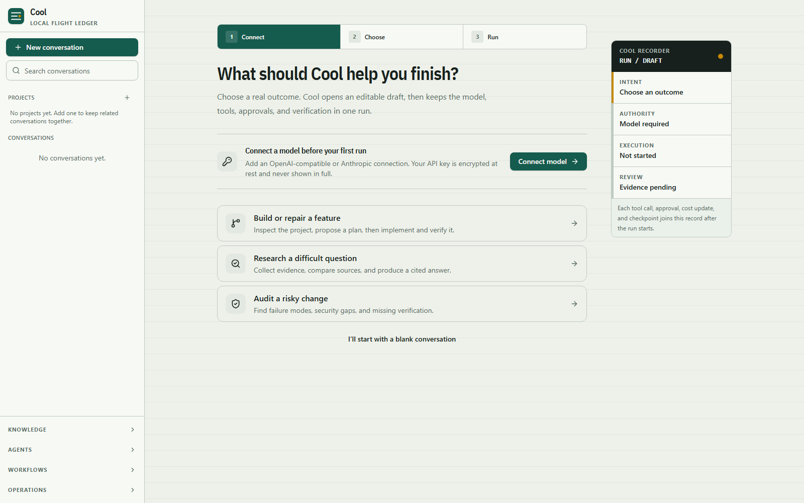
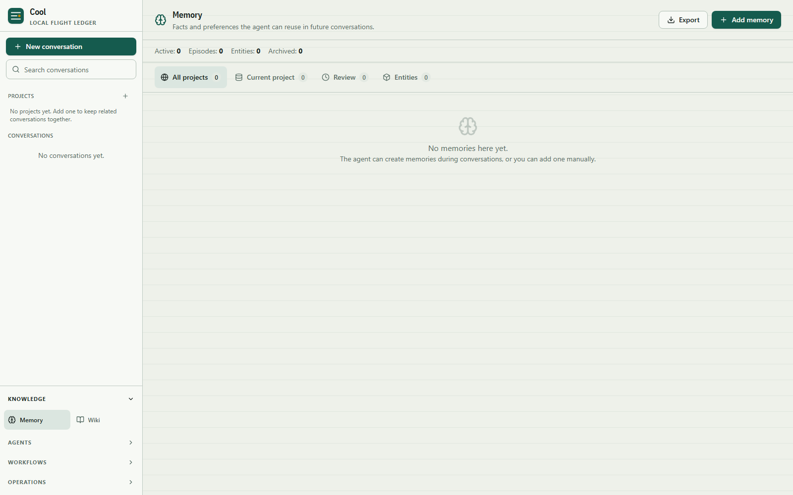
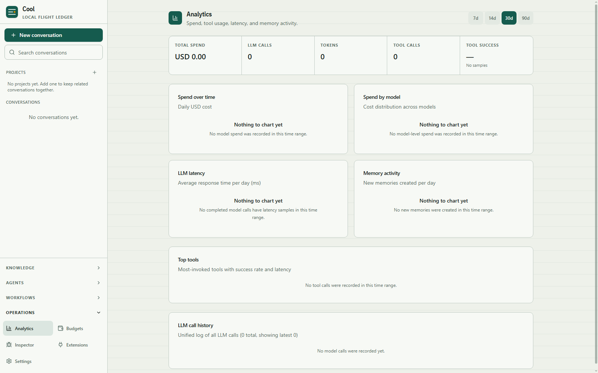
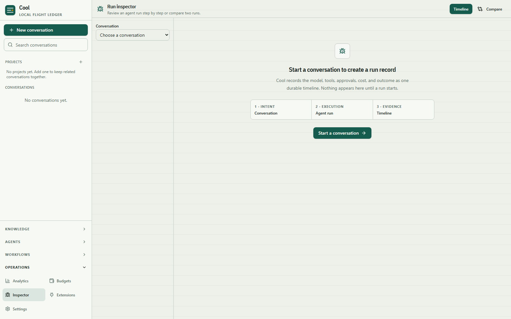
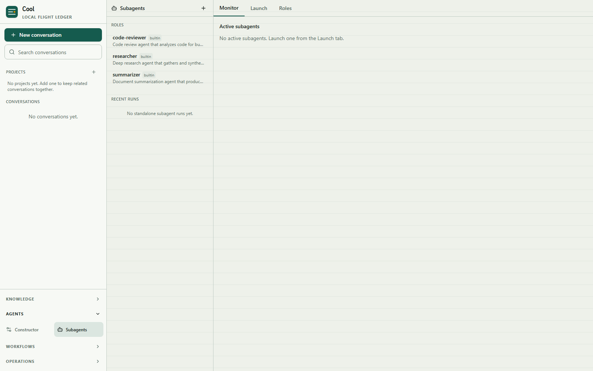
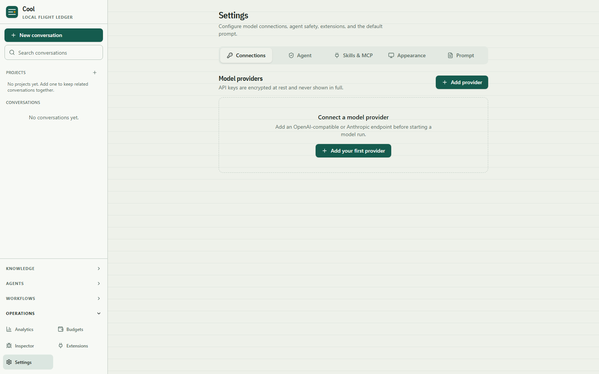

<div align="center">

# Cool

**Personal AI agent harness** — provider abstraction, tools, skills, MCP,
subagents, long-term + working memory, personalities, planning mode, recurring
tasks (cron), RSS aggregation, webhooks, wiki, cost budgets, analytics, an
inspector/replay console, and durable agent runs. Control via the web UI.

[](https://github.com/luckystrker/cool-ai-harness/actions/workflows/ci.yml)
[](https://github.com/luckystrker/cool-ai-harness/releases/latest)
[](https://github.com/luckystrker/cool-ai-harness/releases/tag/nightly)
[](rust-toolchain.toml)
[](LICENSE)

</div>

> Status: **v0.2.0**. Phases 0–4 are shipped on the Rust core; the 0.2 line
> adds the coding-agent toolset (search/edit files, launcher-gated `shell`
> and `git`, output spill), persistent policy rules, an OS sandbox backend,
> `ask_user`, background subagents with git-worktree isolation, lazy tool
> activation, session fork/rewind with filesystem checkpoints, multimodal
> images to vision-capable providers, OAuth sign-in (Claude, ChatGPT,
> Gemini), and a `cool run --mode json` machine-readable mode. Browser
> automation remains a deferred gap (see [`docs/PLAN.md`](docs/PLAN.md) for
> the full roadmap).

## Download

Prebuilt packages — the `cool` binary plus the bundled web UI — are published to
[GitHub Releases](https://github.com/luckystrker/cool-ai-harness/releases) on
every `v*` tag. No Rust/Node/Python toolchain needed; unpack and run
`cool serve --assets ./assets` (see the included `INSTALL.md`).

| Platform | Stable | Nightly |
|---|---|---|
| Linux x86_64 | [cool-linux-x86_64.tar.gz](https://github.com/luckystrker/cool-ai-harness/releases/latest/download/cool-linux-x86_64.tar.gz) | [nightly](https://github.com/luckystrker/cool-ai-harness/releases/download/nightly/cool-linux-x86_64.tar.gz) |
| Windows x86_64 | [cool-windows-x86_64.zip](https://github.com/luckystrker/cool-ai-harness/releases/latest/download/cool-windows-x86_64.zip) | [nightly](https://github.com/luckystrker/cool-ai-harness/releases/download/nightly/cool-windows-x86_64.zip) |
| macOS Apple Silicon | [cool-macos-aarch64.tar.gz](https://github.com/luckystrker/cool-ai-harness/releases/latest/download/cool-macos-aarch64.tar.gz) | [nightly](https://github.com/luckystrker/cool-ai-harness/releases/download/nightly/cool-macos-aarch64.tar.gz) |
| macOS Intel | [cool-macos-x86_64.tar.gz](https://github.com/luckystrker/cool-ai-harness/releases/latest/download/cool-macos-x86_64.tar.gz) | [nightly](https://github.com/luckystrker/cool-ai-harness/releases/download/nightly/cool-macos-x86_64.tar.gz) |

The **nightly** prerelease is rebuilt on every push to `main` — grab it for the
bleeding-edge build. Cutting a release: run the **Release** workflow manually
with a version, or `node scripts/bump-version.mjs X.Y.Z && git tag vX.Y.Z &&
git push origin main --tags`.

## Screenshots

| | |
|---|---|
|  |  |
|  |  |
|  |  |

## Stack

- **Runtime:** Rust trusted core — the single `cool` binary serves the SPA,
  the canonical App Protocol (`POST /api/rpc` + `GET /api/events`), blob
  transports, the agent loop, tools, subagents and deep research. There is no
  Python runtime: the legacy FastAPI server was removed under
  [ADR-0003](docs/migration/adr/0003-remove-legacy-python-server.md); optional
  out-of-process workers follow
  [`docs/backlog/python-workers.md`](docs/backlog/python-workers.md)
- **Frontend:** React 19 + TypeScript + Vite 8 + Tailwind 4 (zustand,
  @tanstack/react-query, Radix-based UI primitives)
- **LLM providers:** OpenAI + Anthropic + Gemini via a single provider
  interface (OpenAI-compatible base URL works for
  OpenRouter/DeepSeek/Groq/Ollama); subscription OAuth sign-in for Claude,
  ChatGPT and Gemini via `cool auth`
- **Scheduler:** in-process cron/interval/date recurring agent tasks
- **RSS:** aggregator with per-subscription filters and LLM summarization
- **Observability:** unified LLM-call log, aggregating dashboards
- **Telegram:** Bot + Web App adapter — planned

## Quick start

### 1. Configure

```bash
cp .env.example .env
# edit .env — set at least OPENAI_API_KEY (or OPENAI_BASE_URL for an
# OpenAI-compatible backend like OpenRouter/DeepSeek/Groq/Ollama)
# also generate a SECRET_KEY (Fernet = 32 url-safe base64 bytes):
openssl rand -base64 32
```

#### OAuth sign-in

`cool auth <provider>` runs a local PKCE flow and stores the tokens
Fernet-encrypted on the provider row (`auth_kind=oauth`, requires
`SECRET_KEY`); drivers refresh on expiry and retry once on 401:

- `cool auth claude` — Anthropic's manual flow: the console shows
  `code#state`, paste it back. Off-label use; an API key stays the
  supported credential.
- `cool auth chatgpt` — OpenAI device-authorization flow (code + URL,
  polls until issued). **Codex tokens authenticate the Codex backend
  (Responses API), not chat/completions** — stored ChatGPT tokens make
  the OpenAI driver report `oauth_wire_not_supported`; use
  `OPENAI_API_KEY` for that wire.
- `cool auth gemini` — Google loopback OAuth (`--device`/`--manual`
  variants exist). Requires `COOL_GOOGLE_CLIENT_ID`/
  `COOL_GOOGLE_CLIENT_SECRET` — the public desktop client Google ships
  with gemini-cli, kept out of this repo (secret scanning); without it
  the flow returns `oauth_client_unconfigured`. Powers
  `COOL_PROVIDER=gemini` when `GEMINI_API_KEY`/`GOOGLE_API_KEY` is unset.

The same flow is exposed to the app over `providers.oauth_start` /
`providers.oauth_complete`; unsupported providers return
`oauth_provider_unsupported`.

### 2. Run the packaged app (recommended)

```bash
# the container binds inside its own network namespace, so it needs a token
echo "COOL_API_TOKEN=$(openssl rand -hex 24)" >> .env
docker compose up --build
```

Open http://127.0.0.1:8000. The production image is a **Rust core + React
bundle**: one `cool` binary serves the UI, the canonical App Protocol API
(`POST /api/rpc`), and the cursor/reconnect event stream (`GET /api/events`) from
one process and one port. The runtime stage contains neither Python nor Node;
Bun is never installed (the OpenCode worker is an opt-in sidecar). State persists
in the Docker-managed `cool-state` volume. The port is published on loopback
only; the `server` profile for VPS deployment requires a TLS/reverse-proxy
boundary.

The container requires a shared token for the API surface. Open the SPA once
with it — `http://127.0.0.1:8000/?token=<COOL_API_TOKEN>` — and the bundle stores
it for the tab and strips it from the URL; the static bundle is public while
`/api/rpc` and `/api/events` stay token-gated.

#### Upgrading a pre-M12 install

A data root written by the retired Python server (`harness.db` at the Alembic
baseline) keeps serving read-only until an operator adopts it:

```bash
cool store adopt --data-dir /var/lib/cool   # verified backup, then Rust owns migrations
cool serve --data-dir /var/lib/cool --assets frontend/dist --legacy-store
```

In the container the image CMD already serves the legacy families
(`--legacy-store`). A fresh volume gets a baseline `harness.db`; an existing
pre-adoption one stays read-only until it is adopted:

```bash
docker compose run --rm cool cool store adopt --data-dir /var/lib/cool
docker compose up
```

Adoption takes a verified backup before the first Rust write and records the
migration owner, so the pre-adoption snapshot can be restored. Re-running adopt
is idempotent; a database at another Alembic revision fails closed.

### 3. Unified source install

```bash
cd frontend
npm ci
npm run build

cd ..
cargo build --release -p cool-cli
./target/release/cool serve --assets frontend/dist --legacy-store
```

This opens the complete application at http://127.0.0.1:8000 (App Protocol API +
SPA). `--legacy-store` initializes a fresh baseline store on first run, or serves
an existing pre-adoption data root read-only until you adopt it (see above). For
frontend hot reload, run `cool serve` in one terminal and `npm run dev`
from `frontend/` in another; Vite remains the development-only split mode.
Rolling an installation back to the retired Python runtime is documented in
[`docs/migration/M12_ROLLBACK.md`](docs/migration/M12_ROLLBACK.md).

### 4. Smoke test

```bash
# health
curl http://localhost:8000/api/health

# canonical App Protocol command (initialize handshake)
curl -X POST http://localhost:8000/api/rpc \
  -H "Content-Type: application/json" \
  -d '{"jsonrpc":"2.0","id":1,"method":"cool.command","params":{"protocolVersion":1,"commandId":"smoke-init","command":{"method":"initialize","params":{"clientName":"curl","clientVersion":"1","supportedProtocolVersions":[1],"capabilities":[]}}}}'
```

The stable entrypoint, path layout, Docker persistence, VPS limitations, and
future Rust replacement boundary are documented in
[`docs/migration/M2_PACKAGING_CONTRACT.md`](docs/migration/M2_PACKAGING_CONTRACT.md).
Docker Compose intentionally publishes only on loopback. The current M2 runtime
is local/single-user only; do not expose it to the Internet. `API_TOKEN` remains
a compatibility option for direct API clients, but the packaged SPA has no token
bootstrap and setting it does not turn M2 into a supported VPS deployment. The
authenticated server profile and Telegram identity adapter remain later phases.

## Durable runs & migrations

Each agent turn is a **durable run**: an `agent_runs` row tracks its
status (`running` → `completed`/`failed`/`cancelled`), cumulative token/cost
usage, iterations, and outcome; an append-only `run_events` log records every
event for replay/inspection. Interactive runs (SSE via `GET /api/events`) are
cancellable via the registry and the cancel endpoint.

On the default runtime these are canonical App Protocol commands
(`session.runs`, `run.events`, `run.cancel`) over `POST /api/rpc` — for
example:

```bash
curl -X POST http://localhost:8000/api/rpc \
  -H "Content-Type: application/json" \
  -d '{"jsonrpc":"2.0","id":1,"method":"cool.command","params":{"protocolVersion":1,"commandId":"c1","command":{"method":"run.events","params":{"runId":"run-…","limit":50}}}}'
```

Schema changes are owned by the Rust store (`crates/cool-store`) at the frozen
baseline `0022_phase4_completion`; `harness.db` files that were never adopted
open read-only and `cool store adopt` is the explicit ownership transfer.

## Agent evals (CI quality gate)

Deterministic, scripted-driver scenarios verify the agent loop's capability
allow/deny policy, approval flow, and partial-failure handling — no API keys
needed. They run as part of the Rust test suite:

```bash
cargo test -p cool-agent --test deterministic_evals
```

Scenarios are declared in
`crates/cool-agent/tests/fixtures/evals.json` and driven by
`crates/cool-agent/tests/deterministic_evals.rs`.

## Subsystems

Beyond the core agent loop, these subsystems are implemented:

- **Durable runs** — every turn is an `AgentRun` with an append-only `run_events`
  log, status (`running`/`awaiting_approval`/`completed`/`failed`/`cancelled`),
  cumulative token/cost usage, checkpoints, and budget guards. Interactive runs
  are cancellable via the registry and the cancel endpoint.
- **Capability security** — permissions split into
  `read`/`write`/`execute`/`network`/`git`/`send_external`; file tools are
  workspace-confined, network tools use an SSRF-protected allowlist, code
  execution is sandboxed, and secrets are masked in messages/traces/logs.
- **Process launcher** — every host-process spawn goes through a
  `ProcessLauncher`: `disabled` (fail-closed default), `host` (JobObject /
  process-group containment, cleared environment, secret redaction), or
  `sandboxed` (Linux `bwrap` selective ro-binds + workspace rw,
  macOS `sandbox-exec` seatbelt restricted reads, Windows JobObject —
  containment only, no FS/net isolation in v1; `cool doctor` reports
  per-backend `isolation`). Selection order: `COOL_PROCESS_LAUNCHER` env →
  `AgentProfile.settings["process_launcher"]` → `cool serve/run` flags
  (`--allow-shell`, `--sandbox=bwrap|seatbelt|jobobject|none`, `--flag=value`
  forms supported). A `network` capability `deny` propagates
  `NetAccess::None` into spawned processes; `NetAccess::Pinned` is refused
  in v1 (needs an allowlist proxy — fail closed, no silent full access).
  Granting `network` (`NetAccess::Full`) is per-run configuration, not a
  rule: `cool run --allow-network` for one-shot runs, and for `cool serve`
  the conversation's capability matrix (Settings → Agent) or
  `AgentProfile.settings["capability_policy"]["network"]` — the profile
  map grants `network` only on the foreground run (its other entries exist
  to narrow children), the conversation map overlays in full, and children
  (subagents, delegated plan steps) narrow the parent's effective policy so
  configured grants propagate but child maps still can't widen. Profile
  `settings["exec_rules"]` apply to the run's session rules the same way
  they do for subagents. `host`/`jobobject` spawns refuse anything below
  `Full`, so shell/git tools need that grant plus a `shell`/`git` allow
  rule or interactive approval; `bwrap`/`seatbelt` can isolate and spawn
  with `None`.
- **Policy rules** — exec rules (`tool` + glob on `program args`, or
  `path_glob`/`domain` patterns) are evaluated *before* the capability
  policy, first match wins, strictest on ties. Scopes: `session`
  (in-memory, per run), `project` (`<workspace>/.cool/policy.json`), `user`
  (durable `policy_rules` table). Approval cards carry a `suggested_rule`
  and a "don't ask again" checkbox; `approval.resolve {remember: "session"
  |"project"|"user"}` persists it; managed via `policy.rules_list` /
  `policy.rule_add` / `policy.rule_delete`.
- **Write diagnostics** — after `write_file`/`edit_file`, a per-extension
  command from `.cool/config.json` (`diagnostics` map, e.g. `rs` →
  `cargo check --message-format=short`) runs through the launcher; output
  is masked, capped at 4 KiB, and reported as `ToolResult.diagnostics`
  (`"skipped"` when the launcher is disabled; failures are warnings).
- **Context management** — token-aware history budgeting/truncation, project
  instructions loading (AGENTS.md from the working directory), in-loop
  LLM-summarized compaction with collapsible chat history, and a
  `.cool/progress.md` progress file the agent updates on long tasks.
- **Output spill** — tool output over the byte cap is spilled to
  `.cool/spill/` files in the workspace and the model receives a head/tail
  view instead of losing the payload.
- **Lazy tool catalog** — deferred/rare tools (e.g. `deep_research`) stay out
  of the context window; the meta-tools `search_tools` and `activate_tools`
  let the agent discover and enable them mid-run.
- **Cost budgets** — per-period spend limits with alert threshold and optional
  block-on-exceed; spend is logged per run.
- **Skills** — discover `SKILL.md` skills from builtin/user dirs; rank by
  TF-IDF keywords/tags (+ optional embedding similarity) and inject relevant
  skill context into the system prompt.
- **MCP** — JSON-RPC 2.0 client over stdio **and** HTTP; connects external MCP
  servers and bridges their tools into the tool registry as `mcp_{server}_{tool}`.
  A marketplace client queries `registry.modelcontextprotocol.io`.
- **Subagents** — isolated conversations + durable runs spawned from roles
  (`researcher`, `code-reviewer`, `summarizer` seeded by default); capability
  policies per role, background (`background=true`) or blocking launch,
  `fork_context` control over parent context, optional git-worktree
  isolation under `.cool/worktrees`, and steering via
  `send_to_subagent` / `collect_subagent` / `list_subagents`.
- **Interactive questions** — `ask_user` lets a running agent ask the human a
  question through the approval machinery (option buttons + free text), and
  fails closed on unattended runs.
- **Session fork & rewind** — `session.fork` branches a conversation at any
  message cursor, and filesystem checkpoints record workspace state per run
  for scoped restore.
- **Planning mode** — research-first loop emits a fenced `plan` JSON block;
  steps have dependencies (topological execution), draft → approve → execute,
  with `plan_progress` events and templates.
- **Memory** — long-term memory (`MemoryItem`/`Episode`) with FTS5
  recall + composite reranking, entity extraction with confirmation/explain
  panels, pinning/export, post-session LLM extraction, decay/consolidation
  sweeps, and working-memory scratchpads; project-scoped visibility. Exposed to
  the agent via memory tools.
- **Personalities** — multiple agent profiles with distinct system
  prompts/names/descriptions; switchable per chat, persisted in the DB
  (`agent_profiles`).
- **Analytics** — aggregating dashboards (spend, tool usage, runs,
  latency), unified LLM-call log, and optional OpenTelemetry export.
- **Inspector** — live tail of in-progress runs over `GET /api/events`, plus
  timeline reconstruction, two-run comparison, and replay over the event log.
- **Recurring tasks** — in-process cron/interval/date agent tasks persisted
  in the DB (`cool-app-server` scheduler); scheduled runs are durable with
  delivery templates (reminders, reports, summaries).
- **RSS** — feed subscriptions with filters, scheduled aggregation, and LLM
  summarization into a digest/inbox.
- **Webhooks** — HTTP webhook router that triggers agent runs/tasks from
  external services (signed, idempotent).
- **Wiki** — markdown article store (`wiki_articles`) with agent search/write
  tools and a browsing UI.
- **Code & Git tools** — `search_files`/`find_files`/`list_files`/
  `read_file`, `write_file`/`edit_file` (atomic anchor edits), policy-gated
  `shell` process execution (fails closed without a configured launcher) and
  a `git` tool; GitHub integration goes through attached MCP servers or the
  `gh` CLI.
- **Deep Research** — durable research runs with parallel subagents, source
  citations, and Markdown/HTML export (PDF/DOCX export is a delegated worker
  stub — see `docs/backlog/python-workers.md`).
- **Multimodal chat** — image/document attachments with blob storage and
  thumbnails; images reach vision-capable providers as native image blocks
  (chat attachments and the `view_image` tool). OCR for scanned documents
  remains a deferred gap.
- **Browser automation** (planned) — isolated Playwright sessions were a
  Python-era feature; no implementation exists on the Rust core yet.
- **Agent Constructor** — reusable blueprints, per-agent limits, tool/skill
  selection, playground runs, sharing/cloning, and macro-tools.
- **Machine-readable CLI** — `cool run --mode json` emits one NDJSON line per
  run event for scripting; `cool doctor` reports environment and launcher
  isolation status.

## Project layout

```
cool-ai-harness/
├── crates/                      # Rust workspace (the trusted core + CLI)
│   ├── cool-protocol/           # versioned App Protocol schema + generator
│   ├── cool-state/              # durable append-only store (rust-core.db)
│   ├── cool-store/              # domain store (harness.db schema owner)
│   ├── cool-security/           # capability policy, SSRF, secrets, sandboxing
│   ├── cool-agent/              # agent loop, providers, tools, evals
│   ├── cool-extensions/         # plugin loader + compatibility workers
│   ├── cool-app-server/         # App Protocol server + legacy family dispatch
│   ├── cool-http/               # browser-facing HTTP/SSE facade (cool serve)
│   ├── cool-cli/                # the `cool` binary (serve/run/store/doctor/...)
│   ├── cool-tui/                # terminal UI
│   └── cool-acp/                # Agent Client Protocol adapter
├── frontend/                    # React 19 SPA (Vite + TypeScript + Tailwind 4)
│   └── src/
│       ├── api/                 # typed boundary to the server (sdk, streaming, clients)
│       ├── hooks/               # useConversationStream + others
│       ├── components/          # chat/, memory/, inspector/, subagents/, layout/, settings/, ui/
│       ├── pages/               # ChatPage, MemoryPage, WikiPage, ProfilesPage, AnalyticsPage,
│       │                        #   TasksPage, SettingsPage, BudgetsPage, SubagentsPage, InspectorPage
│       └── lib/                 # utils, queryClient, agentConfig, modelFormat, projects
├── sdk/typescript/              # generated typed App Protocol client
├── schemas/                     # protocol JSON schemas (acp-v1, cool-protocol-v1)
├── skills/                      # bundled SKILL.md skills
├── packaging/                   # release archive docs (INSTALL.md)
├── docs/
│   ├── PLAN.md                  # roadmap (phases, deferred gaps)
│   ├── RUST_CORE_MIGRATION_PLAN.md  # completed migration plan (archive)
│   ├── migration/               # Rust-core migration checkpoints/ADRs (evidence)
│   ├── backlog/                 # parked workstreams (optional workers, Telegram)
│   └── screenshots/             # README imagery
├── LICENSE                      # MIT
└── .env.example
```

## Roadmap

See [`docs/PLAN.md`](docs/PLAN.md) for the full plan:

| Phase | Status |
|-------|--------|
| **Phase 0** — Foundation | ✅ Done |
| **Phase 1** — Agent loop + tools + chat MVP | ✅ Done |
| **Phase 1.5** — Run reliability, security, artifacts, evals, HITL | ✅ Done |
| **Phase 2** — Skills + MCP + subagents + planning mode | ✅ Done |
| **Phase 3a** — Memory + personalities + observability | ✅ Done |
| **Phase 3b** — Recurring tasks + RSS + webhook | ✅ Done |
| **Phase 4** — Workflows + multimodal + code tools | ✅ Done |
| **0.2 hardening** — coding toolset, sandboxed launcher, policy rules,
  ask_user, async subagents, fork/rewind + FS checkpoints, multimodal
  vision, OAuth providers, `--mode json` | ✅ Done (v0.2.0) |
| **Phase 5** — Telegram + voice interface | ⏳ |
| **Phase 6** — Product readiness + backlog | ⏳ |
| **Phase 7** — UX polish + dev experience | ⏳ |

## License

MIT © 2026 Danil Kondratiuk — see [`LICENSE`](LICENSE).
