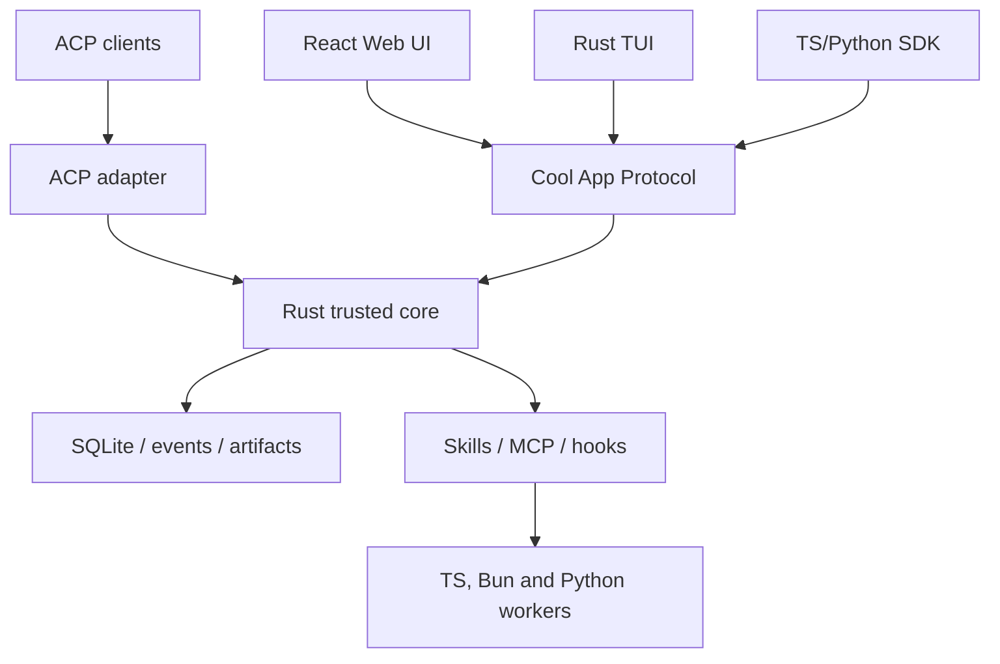

# Cool — план миграции на Rust core

> Статус: active; M0-M3 complete, M4 implementation passed / real-client acceptance pending
> Назначение: исполняемый coding-agent roadmap, дополняющий `docs/PLAN.md`  
> Базовая стратегия: incremental replacement без big-bang rewrite  
> Целевая платформа: Rust trusted core + App Protocol + React Web UI + Rust TUI + ACP + protocol-isolated extensions

## Как агент должен исполнять этот документ

Этот файл — инструкция для coding agent, а не оценка проекта для человека. Агент не должен
рассчитывать сроки, story points или загрузку команды.

Алгоритм исполнения:

1. Прочитать `AGENTS.md`, этот файл, `docs/PLAN.md` и относящиеся к текущей фазе исходники.
2. Найти первую незавершённую фазу, зависимости которой отмечены завершёнными.
3. Проверить фактическое состояние deliverables: статус в таблице сам по себе не является evidence.
4. Составить рабочий task plan только для выбранной фазы.
5. Реализовать фазу небольшими проверяемыми изменениями, не начинать следующую досрочно.
6. Выполнить exit criteria и обязательные проверки; исправить найденные регрессии.
7. После завершения доработок передать фактический diff независимому reviewer/agent в read-only
   режиме. Автор изменений не может засчитать self-review как этот gate. Все actionable findings
   должны быть исправлены либо отклонены с проверяемым обоснованием; security/protocol/state fixes
   проходят повторное независимое ревью.
8. Создать или обновить `docs/migration/checkpoints/MX.md` с доказательствами выполнения и
   результатом независимого ревью.
9. Поменять статус фазы только после прохождения всех gates.
10. Если пользователь поручил весь roadmap, продолжить со следующей доступной фазой. Если поручена
   одна фаза — остановиться после отчёта о ней.

Агент обязан остановиться и запросить решение только при настоящем product/authority blocker:

- нужны credentials, публикация или изменение внешней инфраструктуры;
- требуется необратимая миграция пользовательских данных без проверенного restore path;
- варианты меняют публичную совместимость, а нормативный default ниже не применим;
- выполнение требует снизить security-инвариант или удалить данные.

Ошибки тестов, несовместимые библиотеки, unfamiliar Rust crates и сложность реализации не являются
основанием пропустить gate, ослабить типы/изоляцию или объявить фазу завершённой.

### Статусы фаз

| Порядок | Фаза | Зависимости | Статус | Evidence |
|---:|---|---|---|---|
| 0 | M0 — Architecture ADR и vertical spike | — | [x] complete | [checkpoint](migration/checkpoints/M0.md) |
| 1 | M1 — Rust protocol foundation и golden corpus | M0 | [x] complete | [checkpoint](migration/checkpoints/M1.md) |
| 2 | M2 — Единая поставка текущего приложения | M0 | [x] complete | [checkpoint](migration/checkpoints/M2.md) |
| 3 | M3 — Standard plugin contract | M1 | [x] complete | [checkpoint](migration/checkpoints/M3.md) |
| 4 | M4 — ACP adapter поверх Python runtime | M1 | [~] implementation passed; client acceptance pending | [`M4 checkpoint`](migration/checkpoints/M4.md) |
| 5 | M5 — App Server и CLI skeleton | M0, M1 | [ ] pending | — |
| 6 | M6 — Durable state и security kernel | M5 | [ ] pending | — |
| 7 | M7 — Agent loop и trusted tool runtime | M6 | [ ] pending | — |
| 8 | M8 — MCP, plugins, hooks и workers | M3, M6, M7 | [ ] pending | — |
| 9 | M9 — Rust CLI/TUI и ACP cutover | M4, M7, M8 | [ ] pending | — |
| 10 | M10 — Store и background subsystems parity | M6, M7 | [ ] pending | — |
| 11 | M11 — Web cutover и compatibility workers | M8, M9, M10 | [ ] pending | — |
| 12 | M12 — Default cutover и сокращение Python | M11 | [ ] pending | — |

Фазы с выполненными зависимостями могут реализовываться независимо, но один агент не должен вести
несколько незавершённых фаз одновременно. Колонка `Evidence` должна ссылаться на checkpoint,
тесты, generated artifacts или ADR в репозитории.

### Нормативные технические defaults

Если фаза воспроизводимо не докажет несовместимость, агент использует следующие defaults:

- Rust stable с зафиксированным в `rust-toolchain.toml` channel/MSRV, edition 2024, Cargo workspace,
  Tokio async runtime;
- `clippy -D warnings`, `rustfmt`, deny/allow policy для dependencies и unsafe-кода;
- App Protocol: versioned bidirectional JSON-RPC 2.0 по stdio и local socket;
- Rust protocol types являются источником истины для runtime contract; JSON Schema и TypeScript
  types генерируются и проверяются в CI;
- внешние plugin/compatibility contracts валидируются их pinned upstream JSON Schemas;
- React остаётся TypeScript SPA; TypeScript SDK является клиентом Rust App Server, а не ядром;
- TUI реализуется на Rust и не содержит agent-loop business logic;
- Agent Plugins, Skills, MCP и hooks являются публичной extension boundary;
- недоверенный код никогда не импортируется в Rust core process;
- executable integrations работают как supervised subprocess или remote service;
- основной IPC workers: JSON-RPC/stdio; local socket разрешён для долгоживущих hosts;
- N-API/FFI не используется как публичная plugin boundary;
- Bun разрешён только внутри OpenCode compatibility worker;
- Python разрешён только как optional worker для функций, где его экосистема оправдана;
- базовая установка и базовый provider path не требуют Node, Bun или Python;
- существующая SQLite schema сохраняется до отдельного store cutover;
- shadow mode с реальными side effects запрещён; сравнение выполняется через replay/fixtures.

Замена default требует ADR и spike/test, показывающий, почему default не удовлетворяет обязательному
контракту. Фраза «так проще» без воспроизводимого evidence недостаточна.

## 1. Архитектурное решение

Cool переходит от модели «Python/FastAPI backend + React SPA» к модели:

> Rust trusted core + несколько клиентов + декларативные плагины + изолированные внешние процессы.

Rust становится владельцем долговечного состояния, security decisions и исполнения. TypeScript
остаётся основным языком Web UI, generated SDK и JS/npm compatibility workers, но не является
обязательным слоем всего runtime.

Миграция выполняется постепенно. Python-реализация остаётся рабочей, пока Rust-реализация не
пройдёт functional, security и data parity. `main` должен оставаться релизопригодным после каждой
фазы.

Решение основано не на производительности как самоцели. Rust выбирается для участков, где особенно
важны типизированные state transitions, cancellation, process supervision, resource confinement,
auditability, crash recovery и single-binary distribution.

TypeScript используется там, где важнее скорость адаптации к JS/npm-экосистеме:

- React Web UI;
- generated client SDK;
- OpenCode executable-plugin compatibility;
- опциональные provider/tool workers;
- разработка сторонних MCP servers и hooks.

Python сохраняется как optional worker для OCR, PDF/DOCX, data science, ML и выполнения
пользовательского Python-кода. Ни TypeScript worker, ни Python worker не имеют прямого доступа к
основной БД, secrets store или policy state.

## 2. Цели и не-цели

### 2.1. Цели

1. Один headless Rust runtime, не зависящий от React и конкретного интерфейса.
2. Один versioned App Protocol для Web, TUI, SDK, automations и adapters.
3. `cool`, `cool serve`, `cool run`, `cool app-server` и `cool acp` поставляются одним Rust binary.
4. React assets в production обслуживаются тем же приложением и портом.
5. Rust TUI работает поверх того же runtime contract и состояния, что Web UI.
6. ACP является внешним agent adapter, а не внутренней моделью всех подсистем Cool.
7. Agent Plugins 1.0, Agent Skills, MCP и lifecycle hooks поддерживаются нативно.
8. Codex/Claude declarative plugins импортируются с явной диагностикой совместимости.
9. OpenCode executable JS/TS plugins запускаются только в изолированном Bun worker.
10. Durable runs, append-only events, approvals, budgets, replay и security не деградируют.
11. Существующие SQLite-данные обновляются без ручного экспорта/импорта.
12. Базовый продукт после cutover не требует установленного Python/Node runtime.

### 2.2. Не-цели

- Побайтовое переписывание Python-кода на Rust.
- Запуск полноценного agent runtime в браузере.
- Одновременная замена языка, схемы данных и продуктовой модели.
- Обещание полной совместимости со всеми vendor-specific plugin semantics.
- Стабильный ABI для сторонних динамических Rust-библиотек.
- Загрузка npm-плагинов или native libraries в основной процесс Cool.
- Встраивание Node/Bun-compatible runtime в Rust ради npm compatibility.
- Использование WebAssembly как первичной совместимости с существующими JS-плагинами.
- Переписывание OCR/document/ML tooling на Rust без доказанной пользы.
- Реализация Code Mode/V8 до завершения базового cutover; это отдельная последующая возможность.

## 3. Архитектурные инварианты

Следующие свойства текущего Cool являются blocking gates:

- **Provider abstraction:** agent loop не обращается к vendor SDK напрямую.
- **Streaming-first:** каждый интерактивный run стримится и может быть отменён.
- **Durable execution:** run, status, checkpoint, usage и append-only events сохраняются.
- **Capability security:** `read`, `write`, `execute`, `network`, `git`, `send_external`.
- **Central authorization:** workers предлагают действия, но Rust принимает policy/approval decision.
- **Approvals и audit:** значимые решения имеют источник, actor и append-only запись.
- **Identity boundary:** transport identity аутентифицируется один раз и привязывается к actor,
  session и approval; payload не может подменить identity.
- **Idempotent commands:** retry/reconnect не создаёт второй run, approval или внешний side effect.
- **Workspace confinement:** файловые операции не выходят за разрешённые roots.
- **SSRF protection:** DNS pinning, private/link-local deny, redirect/size/time limits.
- **Secret masking:** секреты не попадают в messages, events, logs и extension context.
- **Atomic budgets:** token/cost/iteration/proactive limits проверяются check-and-increment атомарно.
- **Observability from events:** inspector, recovery и replay восстанавливаются из event log.
- **Memory visibility:** память остаётся project-scoped и доступна через зарегистрированные tools.
- **Deterministic eval gate:** критические сценарии не требуют реальных API-ключей.
- **Crash isolation:** падение plugin/provider/Python worker не завершает core process.
- **No duplicate side effects:** replay/shadow execution не повторяет внешнее действие.

Ни одна Python-подсистема не удаляется, пока Rust replacement не выполняет её инварианты и не
проходит parity tests.

## 4. Целевая архитектура



### 4.1. Rust trusted core владеет

- session/run state machine;
- append-only event log, checkpoints и recovery;
- SQLite migrations после store cutover;
- cancellation, timeouts и bounded queues;
- budgets, usage accounting и atomic counters;
- capability policy, approvals и audit;
- workspace/path confinement, network policy и secret filtering;
- process/worker supervision;
- artifact store;
- provider-neutral model driver contract;
- tool registry и dispatch;
- опасные builtin tools: filesystem, shell, git и sandbox launch;
- MCP host/client и lifecycle hook dispatcher;
- plugin install state, provenance, hashes и lockfile;
- App Server, HTTP/SSE/WebSocket facade и ACP adapter.

### 4.2. Rust core не владеет

- React components и UI state;
- vendor executable plugin semantics;
- произвольный npm module resolution;
- необязательные OCR/document/ML implementations;
- прямую продуктовую логику внутри transport handlers.

### 4.3. TypeScript владеет

- React Web UI;
- generated App Protocol SDK и view-model reducers;
- plugin authoring types и helpers, не дающие обходить core policy;
- OpenCode compatibility host на Bun;
- опциональные out-of-process provider/tool adapters.

### 4.4. Worker contract

Worker не исполняет side effect самостоятельно, если действие может быть выражено core tool intent.
Нормативный цикл:

1. Worker/agent driver предлагает typed intent.
2. Rust валидирует schema, capability, budget и approval state.
3. Rust записывает intent/event до исполнения, где это требуется для recovery.
4. Rust запускает trusted tool или supervised external worker.
5. Rust записывает terminal event и возвращает структурированный result.
6. Worker продолжает reasoning только после получения результата.

Worker RPC обязан поддерживать protocol version, capability negotiation, request IDs, deadlines,
cancellation, heartbeats, structured errors и graceful shutdown. Environment передаётся allowlist,
а не наследуется целиком. Side-effecting worker requests имеют idempotency key; supervisor не
повторяет запрос с неизвестным результатом автоматически.

### 4.5. Предлагаемая структура репозитория

```text
crates/
  cool-cli/                binary и command routing
  cool-core/               session/run state machine и orchestration
  cool-protocol/           Rust command/event types
  cool-app-server/         JSON-RPC transports и client sessions
  cool-state/              SQLite, migrations, event/thread stores
  cool-security/           policy, approvals, budgets, secrets
  cool-tools/              registry и trusted builtin tools
  cool-sandbox/            platform execution adapters
  cool-providers/          model driver contract и baseline providers
  cool-mcp/                MCP client/host и tool bridge
  cool-plugins/            manifests, marketplaces, provenance
  cool-hooks/              lifecycle discovery, trust и dispatch
  cool-acp/                ACP adapter
  cool-tui/                Ratatui client
  cool-http/               Web API, SSE/WS и embedded React assets
  cool-artifacts/          content-addressed artifacts
  cool-observability/      replay/inspection projections
sdk/
  typescript/              generated protocol types + ergonomic client
  python/                  optional client wrapper; не runtime
frontend/                  React SPA
workers/
  opencode/                Bun compatibility worker
  python/                  OCR/document/ML execution workers
legacy/
  python/                  текущий backend после физического перемещения
```

Физическое перемещение `backend/` в `legacy/` выполняется только после стабилизации Rust workspace
и CI. На ранних фазах текущие пути сохраняются, чтобы не смешивать rename с runtime migration.

## 5. Cool App Protocol

### 5.1. Назначение

`cool app-server` — основная граница между runtime и клиентами. Протокол bidirectional и должен
поддерживать server requests для approvals/elicitation, а не только client requests и events.

Транспорты:

- stdio JSONL — default для SDK и subprocess integration;
- Unix domain socket / Windows named pipe — local long-lived clients;
- WebSocket — только через authenticated local/Web facade;
- HTTP/SSE — browser-facing projection, не отдельная business API model.

Сервер использует bounded ingress/outbound queues и возвращает retryable overload error вместо
неограниченного накопления сообщений.

Нормативные deployment profiles:

- `local` — default и первоочередной product path: один OS user, bind только на loopback,
  stdio/local socket защищены правами пользователя, Web получает per-install/session credential и
  строгую origin/CSRF policy. Текущий single-user `API_TOKEN` может оставаться compatibility mode;
- `server` — явный opt-in для VPS: non-loopback bind запрещён без обязательной auth-конфигурации,
  TLS или явно настроенного trusted reverse proxy, secure cookies/tokens, rate limits и audit actor.
  App Protocol stdio/local socket наружу не публикуются; внешний доступ идёт через HTTP/WebSocket
  facade;
- `telegram` — adapter поверх `server`, а не отдельный agent runtime. Backend валидирует raw
  `Telegram.WebApp.initData`, проверяет signature/hash и freshness `auth_date`, не доверяет
  `initDataUnsafe`, отображает Telegram user id в стабильный internal actor и выдаёт короткоживущую
  application session. Bot token остаётся server-side secret.

Local release не обязан реализовывать полноценный multi-user management UI, но protocol/store с M1
не используют неявный `user_id=1`: actor/owner присутствуют в durable records и authorization API,
чтобы включение VPS/Telegram не потребовало ломать event schema или переносить agent loop.

### 5.2. Основные сущности

- `Session` — долгоживущий диалог/рабочая сессия.
- `Run` — durable prompt turn или background execution.
- `Item` — пользовательский ввод или результат агента/tool/artifact внутри run.
- `Command` — versioned запрос клиента.
- `Event` — append-only факт выполнения.
- `ToolCall` — запрос инструмента с capability и approval state.
- `Artifact` — content-addressed результат или вложение.
- `Plan` — durable план и состояния шагов.
- `Plugin` — установленный capability bundle.

Каждый durable `Event` имеет стабильный envelope минимум с `event_id`, `schema_version`,
`session_id`, `run_id`, nullable `item_id`, монотонным `seq` в явно выбранной области,
`occurred_at`, `actor`, `source`, optional `causation_id`/`correlation_id` и typed payload.
Envelope, а не порядок доставки transport frames, является источником порядка и дедупликации.
Persisted event записывается до публикации подписчикам; transient token deltas либо получают явно
документированную durability semantics, либо отделяются от canonical durable facts.

### 5.3. Минимальные методы

```text
initialize / initialized
session.create / session.load / session.list / session.fork
session.prompt / session.steer
run.get / run.list / run.cancel / run.events / run.subscribe / run.unsubscribe
approval.resolve
plugin.install / plugin.list / plugin.enable / plugin.disable / plugin.remove
plugin.validate / plugin.doctor
mcp.list / mcp.reload / mcp.oauth
hooks.list / hooks.trust / hooks.disable
server.health / server.capabilities
```

Мутирующие команды несут `idempotency_key`; повтор с тем же actor и key возвращает исходный
результат, а не повторяет действие. `initialize` согласует protocol version, client instance,
capabilities и limits. Structured errors используют JSON-RPC codes плюс стабильный Cool error code,
`retryable` и безопасные details. `run.events` поддерживает bounded pagination по cursor/`after_seq`,
а subscribe после reconnect сначала делает catch-up из event log и затем переключается на live tail
без gap и duplicate side effects. `approval.resolve` адресует конкретный approval id/revision и
отклоняет stale или уже terminal request.

До Web cutover инвентаризируются и получают typed protocol command/query families все используемые
React surface: providers/settings, workspace/projects, artifacts, plans, subagents, memory/entities,
analytics/budgets, tasks/RSS/webhooks, wiki, research, skills/MCP/plugins/hooks и Agent Constructor.
HTTP routes могут временно оставаться facade, но не определяют отдельную business model.

### 5.4. Группы событий

```text
session.created / session.updated / session.compacted
run.started / run.completed / run.failed / run.cancelled
item.started / item.updated / item.completed
content.delta / reasoning.delta
tool.requested / tool.approval_required / tool.started / tool.completed / tool.failed
plan.created / plan.step_started / plan.step_completed
artifact.created
usage.updated / budget.warning / budget.exceeded
subagent.started / subagent.completed / subagent.failed
worker.started / worker.failed / worker.restarted
```

Rust protocol structs derive serialization and schema metadata. CI regenerates committed JSON
Schema and TypeScript definitions and fails on uncommitted drift. Stable и experimental fields
разделяются capability negotiation или versioned namespace; добавление optional поля не должно
ломать старого клиента.

### 5.5. ACP mapping

| Cool | ACP |
|---|---|
| `Session` | ACP session |
| `session.create` | `session/new` |
| `session.load` | `session/load` |
| `session.prompt` | `session/prompt` |
| `Event` projection | `session/update` notifications |
| `tool.approval_required` | permission request |
| `run.cancel` активного run | `session/cancel` |
| `Plan` | agent plan updates |
| trusted terminal tool | ACP terminal capability |

ACP остаётся adapter: scheduler, RSS, memory administration, analytics, plugin management и
artifact internals не ограничиваются ACP surface.

## 6. Plugin architecture

### 6.1. Публичная модель расширений

Публичный plugin не получает Rust objects и не загружается как dynamic library. Portable bundle
Agent Plugins 1.0 содержит только стандартизованные locations, а Cool-specific capabilities живут
в выбранном в M0 reverse-DNS extension namespace:

```text
plugin/
  plugin.json
  skills/
  mcp.json
  io.github.luckystrker.cool/
    hooks/
    assets/
```

Каноническая внутренняя модель описывается Rust types и включает:

- manifest identity/interface/provenance;
- skill roots;
- MCP server declarations;
- lifecycle hook declarations;
- connector/app metadata;
- optional compatibility metadata;
- diagnostics для supported/transformed/ignored/unsafe fields.

Hooks/assets не объявляются частью Tier 1 conformance: это Cool client extension. Core manifest
остаётся закрытым по Agent Plugins 1.0, а неизвестные top-level fields не получают Cool semantics.

### 6.2. Уровни совместимости

| Tier | Формат | Обязательство |
|---|---|---|
| 1 | Agent Plugins 1.0 + Agent Skills + MCP | Полная conformance |
| 2 | Codex declarative plugins | Skills/MCP/hooks/apps по документированной матрице |
| 2 | Claude Code declarative subset | Skills/MCP/agents/hooks с semantic diagnostics |
| 3 | Vendor commands, LSP и дополнительные metadata | Compatibility adapters |
| 4 | OpenCode executable JS/TS plugins | Experimental isolated Bun worker |

`cool plugin doctor` обязан показывать происхождение bundle, требуемые runtimes/permissions,
поддержанные компоненты, преобразования, ignored fields и blockers. Совместимость не обозначается
одним boolean.

### 6.3. Skills

Skills являются инструкциями и ресурсами. Скрипт внутри skill исполняется только через обычный
tool/worker path с capability checks. Skill loader не превращает содержимое `SKILL.md` в доверенный
код и не разрешает обход context budget.

### 6.4. MCP

MCP является основной исполняемой extension boundary:

- local stdio servers;
- Streamable HTTP servers;
- OAuth/bearer auth;
- startup/tool timeouts;
- enabled/disabled tool policies;
- read/write annotations и approval modes;
- server instructions с ограниченным context budget;
- crash/restart/status events через supervisor.

MCP server может быть написан на TypeScript, Python, Rust или другом языке. Язык server не влияет
на trust policy core.

### 6.5. Hooks

Нативные hook handlers:

- supervised command;
- MCP tool.

Минимальный lifecycle scope: `SessionStart`, `SessionEnd`, `UserPromptSubmit`, `PreToolUse`,
`PermissionRequest`, `PostToolUse`, `PreCompact`, `PostCompact`, `SubagentStart`, `SubagentStop`,
`Stop`, `Interrupt`.

До первого запуска non-managed hook пользователь проверяет точное определение. Trust хранится по
нормализованному hash; изменение command, args, environment, matcher или source сбрасывает trust.
Несколько matching hooks имеют документированный порядок/режим concurrency. Hook не получает
прямой DB handle и не может расширить capability grant текущего run.

### 6.6. Internal Rust extensions

Compile-time registry разрешён для встроенных компонентов Cool. Он не объявляется стабильным
публичным ABI. Сторонняя интеграция, которой требуется выполнение, публикуется как MCP server,
hook command или supervised worker.

### 6.7. OpenCode compatibility worker

OpenCode worker:

- запускается отдельным Bun process только при наличии executable plugin;
- имеет собственный pinned lockfile/cache root;
- общается с Rust по versioned RPC;
- получает только granted workspace paths, env и tool facade;
- не имеет прямого доступа к DB, auth store и process supervisor;
- переживает restart без потери durable run state;
- маркируется experimental до прохождения compatibility corpus.

Не пытаться эмулировать Bun/Node/npm APIs внутри Rust. V8/Code Mode, если появится позднее, является
sandbox для короткой оркестрации разрешённых tools, а не npm plugin runtime.

### 6.8. Supply-chain требования

- source, version/revision, content hash и resolved dependency metadata сохраняются;
- Git source pin-ится commit SHA; moving branch/tag не считается lock;
- install и update разделены;
- symlinks/path traversal не позволяют читать файлы за plugin root;
- plugin data root отделён от immutable installation root;
- permissions и runtime dependencies видны до enable;
- uninstall не удаляет пользовательские данные без отдельного подтверждения;
- audit связывает side effect с plugin/hook/tool identity.

### 6.9. Нормативные внешние контракты

При расхождении локальной реализации с документацией источником истины считаются:

- [Agent Plugins 1.0](https://agent-plugins.org/specification);
- [Agent Skills](https://agentskills.io/specification);
- [Model Context Protocol](https://modelcontextprotocol.io/specification/2026-07-28);
- [Agent Client Protocol v1](https://agentclientprotocol.com/protocol/v1/overview);
- [Codex plugin packaging](https://developers.openai.com/plugins/build/plugins);
- [Codex App Server](https://developers.openai.com/codex/app-server);
- [Codex hooks](https://developers.openai.com/codex/hooks);
- [Claude Code plugins](https://code.claude.com/docs/en/plugins-reference);
- [OpenCode plugins](https://opencode.ai/docs/plugins/);
- [OpenCode ACP](https://opencode.ai/docs/acp/).

Версии pin-ятся в compatibility fixtures. Новый upstream major/minor не включается автоматически.

## 7. Клиенты и поставка

### 7.1. Целевые команды

```text
cool                         открыть Rust TUI
cool serve                   Web/API server + embedded React assets
cool app-server              App Protocol over stdio/local socket
cool run <prompt>            non-interactive run
cool acp                     ACP agent over stdio
cool plugin install <source>
cool plugin list
cool plugin validate <path>
cool plugin doctor [name]
cool mcp list
cool hooks list
cool doctor                  environment и runtime diagnostics
```

### 7.2. Rust TUI MVP

- выбор project/session;
- создание, resume и fork session;
- streaming content/reasoning;
- tool calls и результаты;
- approval allow/deny;
- plan progress;
- cancel/retry/steer;
- model/profile/mode switch;
- slash commands;
- plugin, MCP и worker status.

Memory review, analytics, budget configuration, deep-research comparison и сложные settings
первоначально остаются в Web UI. TUI использует App Protocol/reducer contracts и не обращается к
SQLite или core internals напрямую.

### 7.3. Single-app distribution

- основной артефакт — platform-specific Rust binary;
- production React build встраивается или поставляется как version-matched resource bundle;
- один data root, config stack и process supervisor;
- базовый chat/tool/MCP path не требует Node/Python;
- plugin-declared runtime dependency диагностируется до запуска;
- Bun/Python sidecars поставляются опционально или вызываются из явной configured installation;
- container distribution использует один entrypoint и один публичный port.

«Одно приложение» означает одну установку, команду, конфигурацию и lifecycle ownership, а не запрет
на изолированные дочерние процессы.

## 8. Provider architecture

Rust core определяет `ModelDriver` contract, владеет streaming lifecycle, cancellation, retries,
usage и budget accounting. Provider не пишет events/DB напрямую.

Нормативный baseline:

- минимум один OpenAI-compatible provider реализован in-process на Rust, чтобы базовая установка
  не зависела от Node/Python;
- parity текущих обязательных providers определяется M0 ADR после инвентаризации реально
  используемых возможностей;
- быстро меняющиеся или community providers могут быть out-of-process workers;
- TypeScript provider SDK реализует тот же protocol и conformance suite;
- worker не получает сырые secrets, кроме явно необходимых provider credentials;
- provider result нормализуется до core-owned streaming events.

Vendor SDK не должен диктовать внутреннюю event model. При выборе между SDK и прямым HTTP client
агент фиксирует ADR с учётом streaming, auth, retries и API compatibility.

## 9. Стратегия данных

1. Существующая SQLite schema сохраняется на ранних фазах.
2. Python/Alembic остаётся единственным владельцем migrations до M10 gate.
3. Rust store сначала работает read-only против копий/fixtures БД.
4. Каждая поддерживаемая schema revision имеет snapshot и compatibility test.
5. Rust SQL layer не полагается на неявный ORM behavior текущих SQLModel models.
6. Перед первым Rust write в пользовательскую БД создаётся и проверяется backup/restore path.
7. В cutover фиксируется последняя Alembic revision как Rust migration baseline.
8. После ownership cutover новые migrations создаёт только Rust migration system.
9. Python и Rust никогда не выполняют конкурирующие migrations при одном startup.
10. SQLite write ownership в каждый момент принадлежит одному runtime; dual-write запрещён.
11. M0/M1 spikes пишут только в disposable DB под test/temp root и никогда не открывают рабочую БД
    на запись; это не считается store cutover.
12. До cutover фиксируются SQLite pragmas, transaction/isolation semantics, busy handling,
    foreign-key enforcement и уникальность event sequence, чтобы Rust и Python одинаково трактовали
    concurrency и crash recovery.
13. Формат зашифрованных provider credentials, derivation из `SECRET_KEY`, key rotation и failure
    behavior получают compatibility fixtures. Rust не помечает secret migration успешной, пока не
    доказаны decrypt старых ciphertext и rollback без появления plaintext в БД/log/events.

Проверки минимум на:

- чистой БД;
- БД с данными ранних фаз;
- текущей production-like БД;
- БД без доступного `sqlite-vec`;
- corrupt/incomplete run fixture;
- restart в середине migration;
- rollback-копии перед необратимым изменением;
- существующих Fernet ciphertext с валидным, неверным и rotated key;
- конкурентной вставки событий и повторной доставки mutating command.

Memory/vector implementation может остаться optional worker/index, но canonical memory records,
visibility и lifecycle state принадлежат Rust store после cutover.

## 10. Фазы миграции

### M0 — Architecture ADR и vertical spike

Deliverables:

- ADR: Rust trusted core, App Protocol и incremental replacement;
- ownership map Python → Rust crates / TS workers / retained Python workers;
- trust-boundary и threat-model diagram;
- decision по Rust toolchain, async runtime, SQLite crate, schema/type generation;
- decision по App Protocol transport/versioning/error model;
- decision по event durability/envelope, sequence scope, reconnect/cursor и command idempotency;
- deployment/auth ADR, закрепляющий default `local`/single-user и совместимые opt-in
  `server`/VPS + `telegram` profiles, identity/session/origin/CSRF и trusted-proxy boundaries;
- inventory всех HTTP/SSE/WebSocket surface и ownership их будущих protocol families;
- compatibility plan для Fernet secrets, config/data/project identity и cross-platform paths;
- provider parity inventory;
- plugin compatibility scope и namespace `io.github.luckystrker.cool`;
- feature flags: `python`, `rust`, `replay`; side-effecting `shadow` отсутствует;
- vertical spike, не используемый как production shortcut.

Spike обязан быть isolated throwaway harness под `spikes/` и реализовать только наиболее рискованный
end-to-end путь:

1. Минимальную Rust session/run state machine и append-only events в disposable SQLite DB.
2. Scripted external worker, который стримит model response и предлагает tool intent.
3. Rust capability check, approval request, tool dispatch и terminal event.
4. App Protocol client, получающий тот же event stream.
5. Принудительное завершение worker во время run и recoverable terminal state/restart behavior.

Agent Plugins/MCP/Bun/OpenCode не реализуются в M0: их contract и threat model фиксируются в ADR,
а executable integration принадлежит M3/M8. Spike не открывает production-like DB на запись, не
становится временным production runtime и может быть удалён после переноса доказанных решений.

Exit criteria:

- spike доказывает, что IPC не дублирует внутреннюю модель целиком;
- crash worker не повреждает event log и не обходит approval;
- replay строит одинаковое client state;
- повтор mutating command с тем же idempotency key не дублирует run/tool side effect;
- reconnect from cursor не теряет durable events;
- ADR фиксирует, какие части spike должны быть переписаны для production;
- создан `docs/migration/checkpoints/M0.md`.

### M1 — Rust protocol foundation и golden corpus

Deliverables:

- минимальный Cargo workspace с `cool-protocol` и закреплённым toolchain/MSRV;
- versioned canonical command/event schemas, envelope, error и pagination/cursor types;
- inventory и Python adapters всех client-visible streams, включая текущие `AgentEvent`, research,
  inspector/subagent streams и approval/breakpoint flows;
- Rust protocol types и schema generation proof;
- generated TypeScript client types;
- golden traces для chat, parallel tools, approval/breakpoint, cancel/reconnect, plan, subagent,
  multimodal/artifact, budget, research, worker crash и error;
- black-box contract runner и deterministic client reducer;
- CI drift check для Python adapter, Rust types и frontend types.

Exit criteria:

- текущий Web UI работает через canonical event adapter;
- все существующие critical scenarios сериализуются без потери semantic fields;
- replay одного trace даёт одинаковое client state в Rust и TypeScript reducer;
- committed schema/TypeScript artifacts воспроизводимо генерируются из `cool-protocol` без diff;
- protocol evolution rules зафиксированы в ADR/checkpoint.

### M2 — Единая поставка текущего приложения

Deliverables:

- production image/package, собирающий React и текущий backend;
- один entrypoint и port;
- единые data/config/workspace paths;
- smoke tests `/`, `/api/health`, SSE и WebSocket;
- packaging contract, который позднее примет Rust binary без изменения user-facing layout.

Фаза решает текущую проблему развёртывания и не зависит от завершения Rust-переноса.

### M3 — Standard plugin contract на текущем runtime

Deliverables:

- Agent Plugins 1.0 parser/validator;
- Agent Skills conformance;
- MCP declarations;
- canonical hook declarations и trust-hash model;
- install/list/enable/disable/remove lifecycle;
- plugin lockfile, provenance и plugin data root;
- local path и pinned Git source;
- `plugin validate` и `plugin doctor`;
- fixtures реальных portable/Codex/Claude plugins;
- supply-chain threat model.

Exit criteria:

- Tier 1 conformance suite проходит;
- существующие Cool skills загружаются через canonical plugin layer;
- broken capability не скрывает diagnostics и не повреждает остальные bundles;
- contract не требует Python object callbacks и переносим в Rust.

### M4 — ACP adapter поверх Python runtime

Deliverables:

- `cool acp` JSON-RPC/stdio server;
- initialize/capability negotiation;
- new/load/prompt/cancel;
- content, tool, permission и plan updates;
- ACP ↔ canonical event adapter;
- integration fixtures;
- smoke test минимум с Zed и вторым ACP client.

Exit criteria:

- coding session можно начать, продолжить, подтвердить tool call и отменить из ACP client;
- ACP и Web видят один durable run/event log;
- adapter не становится владельцем state или tool execution.

### M5 — App Server и CLI skeleton

Deliverables:

- расширение созданного в M1 Cargo workspace crates skeleton из раздела 4.5;
- `cool` binary с `app-server`, `serve`, `run`, `doctor` command routing;
- initialize handshake и protocol capability negotiation;
- stdio и local-socket transports;
- использование generated JSON Schema/TypeScript artifacts из M1 без ручных wire types;
- bounded queues, cancellation tokens и structured errors;
- cross-platform build/release CI;
- Rust dependency/security policy.

Exit criteria:

- TS sample client запускает `cool app-server`, создаёт ephemeral session и получает events;
- protocol artifacts воспроизводимо генерируются без diff;
- overload/cancel/disconnect tests проходят;
- reconnect/catch-up test доказывает отсутствие gap и повторного side effect;
- transport crates не содержат agent-loop business logic.

### M6 — Durable state и security kernel

Переносятся:

- run/session state machine;
- append-only events и checkpoints;
- artifact references;
- capability types и policy evaluation;
- approvals, audit и actor/source provenance;
- budgets и atomic counters;
- workspace/path confinement;
- SSRF/network policy primitives;
- secret filtering;
- Fernet/config secret compatibility reader, rotation path и versioned at-rest format;
- worker supervisor lifecycle.

Python временно остаётся execution backend через adapter.

Exit criteria:

- invalid state transitions отклоняются до записи side effect;
- approval/budget races покрыты concurrency tests;
- worker kill/restart и core restart восстанавливают однозначный run state;
- security parity suite не имеет skipped critical tests;
- event replay является источником inspector state.

### M7 — Agent loop и trusted tool runtime

Переносятся:

- provider-neutral agent loop;
- streaming, retry и cancellation lifecycle;
- parallel tool batches и partial failure semantics;
- tool registry/dispatch;
- filesystem, shell, git и sandbox launch tools;
- planning, subagents и context compaction;
- project instructions;
- baseline provider path;
- Python fallback adapter для ещё не перенесённых tools.

Exit criteria:

- scripted provider проходит chat/tool/approval/cancel loops в Rust;
- critical deterministic evals проходят на Rust runtime;
- оборванный tool batch сохраняет валидную историю;
- sandbox and capability decisions совпадают с canonical fixtures;
- side-effect comparison использует replay, а не dual execution.

### M8 — MCP, plugins, hooks и workers

Deliverables:

- Rust plugin loader/store по M3 contract;
- skills discovery/loading;
- MCP stdio и Streamable HTTP client, OAuth boundary и tool policies;
- lifecycle hook engine с command/MCP handlers;
- trust hash, review state и hook audit;
- generic worker protocol/supervisor;
- Codex/Claude compatibility adapters;
- plugin/worker status events и CLI diagnostics;
- migration existing Cool plugin records/config.

Exit criteria:

- Tier 1 и declarative Tier 2 suites проходят на Rust;
- plugin MCP/hook crash не завершает core;
- untrusted/changed hook не запускается;
- plugin policy может только сужать, но не расширять declared/core permissions;
- ни один executable plugin не импортируется в core process.

### M9 — Rust CLI/TUI и ACP cutover

Deliverables:

- Rust CLI commands из раздела 7.1;
- Ratatui TUI MVP;
- generated/shared client reducer conformance;
- ACP adapter перенесён на Rust core;
- session resume/fork/steer/cancel;
- approval и plugin/MCP status UX;
- terminal resize, paste, shutdown и reconnect tests.

Exit criteria:

- TUI выполняет полный интерактивный run с approval и cancellation;
- TUI не читает DB и не содержит agent-loop business logic;
- ACP, TUI и reference TS client видят один event order/client state;
- TUI/ACP больше не требуют запущенного Python server.

### M10 — Store и background subsystems parity

Переносятся:

- conversations/messages/runs/events;
- SQLite migration ownership;
- artifacts и inspector/replay;
- analytics и budgets persistence;
- tasks/scheduler/webhooks/RSS/wiki;
- profiles и constructor metadata;
- memory canonical records, FTS/vector adapters и lifecycle;
- research runs/sources/export metadata и provider/settings records;
- typed App Protocol command/query handlers для каждого React surface из inventory M0/M1;
- crash recovery, catch-up, misfire и overlap policies.

Exit criteria:

- копия существующей БД открывается/обновляется Rust runtime без потери данных;
- backup/restore и interrupted-migration tests проходят;
- scheduler restart/catch-up/misfire/overlap tests проходят;
- memory visibility/retrieval parity подтверждены;
- inspector строит timeline из event log;
- contract coverage test подтверждает, что каждый используемый frontend API operation имеет
  generated SDK method или явно задокументированный static/blob transport exception;
- Alembic и Rust migrations не конкурируют.

### M11 — Web cutover и compatibility workers

Deliverables:

- React UI переключён на Rust HTTP/App Protocol facade;
- generated TypeScript SDK используется как единственная typed boundary;
- все chat, research, inspector и subagent live streams используют canonical cursor/reconnect model;
- production-ready opt-in `server` profile для VPS и Telegram adapter, валидирующий Mini App
  `initData` и использующий тот же actor/session/run contract;
- React production assets обслуживаются Rust binary;
- OpenCode Bun worker и experimental ABI subset;
- optional Python OCR/document/ML workers;
- worker permission review/status UI;
- end-to-end packaging и upgrade tests.

Exit criteria:

- Web, TUI и ACP используют один Rust runtime и durable event model;
- все существующие React pages проходят route/contract smoke suite без обращения к Python API;
- local mode остаётся loopback-only по умолчанию; server mode fail-closed без auth/TLS boundary;
- Telegram identity forgery, stale `auth_date`, replay и cross-user access покрыты integration tests;
- crash/timeout любого worker не завершает core и виден пользователю;
- отсутствие Bun/Python не ломает базовую установку;
- unsupported vendor semantics отображаются явно;
- один binary/entrypoint обслуживает Web API и assets.

### M12 — Default cutover и сокращение Python

Deliverables:

- Rust runtime включён по умолчанию;
- documented rollback release;
- Python server удалён из default startup;
- нужные Python функции оформлены как explicit optional workers/tools;
- обновлены README, `AGENTS.md`, `docs/PLAN.md` и installation docs;
- legacy Python tests архивированы или заменены parity coverage;
- отдельный ADR на удаление legacy server.

Exit criteria:

- чистая установка выполняет базовый chat/tool/MCP flow без Python/Node/Bun;
- upgrade существующей установки автоматизирован и проверен;
- два последовательных релиза прошли без возврата на Python runtime;
- critical eval, security, migration, plugin, ACP и packaging gates проходят;
- legacy server удалён только после отдельного одобрения ADR.

## 11. Порядок текущей продуктовой разработки

До завершения M1:

- разрешены bug fixes, security fixes, evals, UI polish и документация;
- новые events сначала добавляются в canonical protocol;
- Web UI не получает новые прямые зависимости от Python-specific schemas;
- persistence-heavy feature требует решения, реализовать ли её один раз после Rust store cutover.

Telegram/Voice следует отложить минимум до M1: новый channel должен использовать canonical App
Protocol, а не FastAPI internals. Telegram Bot/Mini App реализуется как adapter профиля `server` и
не содержит отдельного agent loop, approval store или policy engine. После M5 новые clients строятся
только через protocol/SDK. После M6 новые security-sensitive side effects сначала проектируются как
core intents/policies.

## 12. Тестовая стратегия

### 12.1. Обязательные наборы

- Rust unit/integration/property/concurrency tests;
- schema/serialization compatibility tests;
- event envelope ordering, idempotency and reconnect/cursor tests;
- Python ↔ Rust black-box parity;
- Rust ↔ TypeScript reducer parity;
- golden event replay;
- deterministic agent evals;
- security/adversarial suite;
- process crash/cancellation/backpressure suite;
- SQLite migration/backup/restore fixtures;
- Agent Plugins/Skills/MCP conformance fixtures;
- Codex/Claude/OpenCode compatibility corpus;
- hook trust and mutation tests;
- ACP integration tests;
- Web/TUI client-state tests;
- frontend API inventory/coverage test for generated SDK methods;
- auth/identity/origin tests для local, loopback Web и declared remote mode;
- encrypted-secret compatibility/rotation tests без plaintext snapshots;
- cross-platform packaging smoke tests.

### 12.2. Метрики parity

- terminal run status;
- ordered event kinds и обязательные payload fields;
- event ids/sequence/cursor и отсутствие duplicates после reconnect;
- tool selection и normalized arguments;
- approval decision/source;
- persisted messages/tool results;
- usage, cost, limits и atomic counters;
- security decision и effective capability set;
- artifact hashes;
- plan/subagent terminal states;
- worker crash/restart state;
- replayed client state;
- CRUD/query parity для всех используемых React API surface.

Model text/token deltas не сравниваются побайтово для реальных providers. Строгая
детерминированность требуется для scripted providers и recorded fixtures.

### 12.3. Phase gates

Пока существует Python runtime:

```bash
cd backend
ruff check .
mypy app
pytest
python -m evals
```

Для React/TypeScript:

```bash
cd frontend
npm run lint
npm run build
```

Начиная с M1 для Rust workspace:

```bash
cargo fmt --all -- --check
cargo clippy --workspace --all-targets --all-features -- -D warnings
cargo test --workspace --all-features
cargo build --workspace --all-targets
```

После появления TypeScript SDK/workers их root scripts фиксируются в package manifest/CI:

```bash
<workspace-package-manager> lint
<workspace-package-manager> typecheck
<workspace-package-manager> test
<workspace-package-manager> build
```

Агент выполняет команды для всех затронутых roots. Отсутствующая обязательная команда считается
незавершённым deliverable, а не пропускается.

До первого Rust commit baseline CI должен реально исполнять те же обязательные Python checks,
включая `mypy app` и `python -m evals`, а не только перечислять их в документации. Начиная с M1 CI
добавляет Rust gates на Linux, Windows и macOS; platform-specific transport/path tests не могут быть
заменены одной Linux job.

## 13. Release, migrations и rollback

- Нет долгоживущей rewrite-ветки; каждая фаза вливается небольшими PR.
- Runtime выбирается feature flag до M12.
- Schema migration и runtime-default cutover разделяются на разные releases/commits.
- Перед первым Rust write в пользовательскую БД создаётся проверяемая backup-копия.
- Необратимая migration запрещена без restore test.
- SQLite dual-write запрещён.
- При parity/security regression release остаётся на Python runtime.
- Shadow mode для side effects запрещён; используются replay и scripted runs.
- Worker protocol поддерживает минимум текущую и предыдущую stable version на upgrade boundary либо
  supervisor выполняет atomic coordinated upgrade.
- Удаление legacy code не объединяется с первым default-cutover commit.

## 14. Итоговый Definition of Done

Миграция завершена, когда одновременно выполнены условия:

1. `cool`, `cool serve`, `cool app-server`, `cool run` и `cool acp` используют Rust core.
2. Web, Rust TUI, SDK и ACP отображают один durable session/run/item/event model.
3. App Protocol schema и TypeScript SDK генерируются из versioned Rust types без drift.
4. Agent Plugins 1.0, Agent Skills и MCP проходят conformance tests.
5. Codex и Claude plugins имеют документированный compatibility level.
6. OpenCode executable plugins работают только в изолированном experimental Bun worker.
7. Hooks запускаются как trusted-hash command/MCP handlers и не обходят core policy.
8. Существующие данные мигрируются без потери runs, messages, memory и artifacts.
9. Critical eval, security, crash, migration и packaging gates проходят без исключений.
10. Default production install — один Rust entrypoint, один port, один data root.
11. Базовый продукт не требует Python, Node или Bun.
12. Python и TypeScript остаются только optional worker/client dependencies.
13. Legacy Python server удалён не ранее двух стабильных Rust-default releases и отдельного ADR.

## 15. Обязательный phase checkpoint

Для каждой завершённой фазы агент создаёт `docs/migration/checkpoints/MX.md`:

```markdown
# MX checkpoint

## Implemented
- изменённые runtime contracts и подсистемы

## Evidence
- пути к тестам, fixtures, ADR и generated schemas

## Verification
- точные выполненные команды и их результат

## Compatibility
- что осталось backward-compatible
- какие versioned adapters добавлены

## Data and security
- влияние на данные, permissions, secrets, sandbox и worker isolation

## Deferred
- элементы, явно принадлежащие следующим фазам
```

Checkpoint не содержит оценок времени. Незавершённый пункт переносится в `Deferred` только если он
не входит в exit criteria текущей фазы; иначе фаза остаётся `pending`.

## 16. Запреты для агента

Агент не должен:

- объявлять Rust rewrite завершённым по факту успешной компиляции без parity/security evidence;
- превращать App Server, HTTP handlers, TUI или ACP adapter во второй agent core;
- давать worker прямой доступ к SQLite/auth/secrets store;
- выполнять npm plugin in-process;
- использовать N-API/FFI как shortcut публичной extension architecture;
- маскировать unsupported plugin semantics молчаливым ignore;
- выполнять один side effect одновременно через Python и Rust для сравнения;
- менять schema ownership и runtime default в одном необратимом шаге;
- удалять legacy Python server без M12 gate и отдельного ADR.
