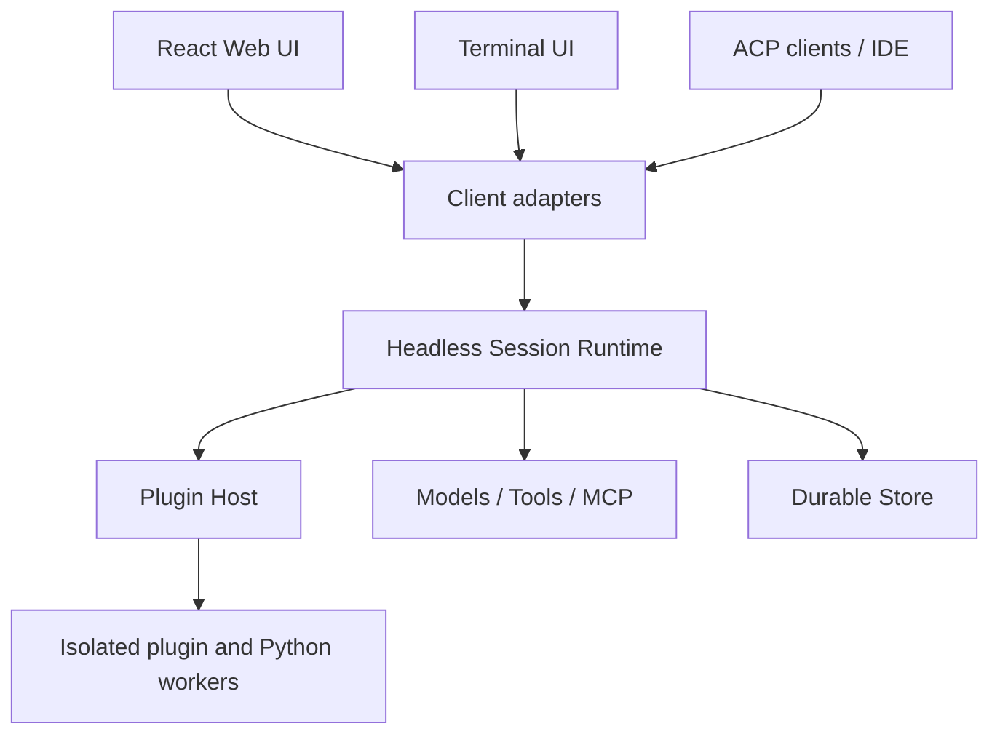

# Cool — план миграции ядра на TypeScript

> Статус: proposed  
> Назначение: отдельный технический roadmap, дополняющий `docs/PLAN.md`  
> Базовая стратегия: incremental replacement без big-bang rewrite  
> Целевая платформа: headless TypeScript runtime + Web UI + TUI + ACP + plugin host

## Как агент должен исполнять этот документ

Этот файл — инструкция для coding agent, а не оценка проекта для человека.
Агент не должен рассчитывать сроки, story points или загрузку команды.

Алгоритм исполнения:

1. Прочитать `AGENTS.md`, этот файл, `docs/PLAN.md` и относящиеся к текущей фазе исходники.
2. Найти первую незавершённую фазу, зависимости которой отмечены завершёнными.
3. Проверить, не выполнены ли её deliverables уже фактически. Не доверять одному статусу в таблице.
4. Составить внутренний task plan только для выбранной фазы.
5. Реализовать фазу небольшими проверяемыми изменениями, не начинать следующую досрочно.
6. Выполнить exit criteria и обязательные проверки. Исправить найденные регрессии.
7. Создать или обновить `docs/migration/checkpoints/MX.md` с доказательствами выполнения.
8. Поменять статус фазы в таблице только после прохождения всех gates.
9. Если пользователь поручил весь roadmap, продолжить со следующей доступной фазой. Если поручена
   одна фаза — остановиться после отчёта о ней.

Агент обязан остановиться и запросить решение только при настоящем product/authority blocker:

- нужны credentials, публикация или изменение внешней инфраструктуры;
- требуется необратимая миграция пользовательских данных без проверенного restore path;
- два варианта меняют публичную совместимость и ни один default ниже не применим;
- выполнение требует снизить security-инвариант или удалить данные.

Ошибки тестов, несовместимые библиотеки и сложность реализации не являются основанием
пропустить gate или объявить фазу завершённой.

### Статусы фаз

| Порядок | Фаза | Зависимости | Статус | Evidence |
|---:|---|---|---|---|
| 0 | M0 — ADR и guardrails | — | [ ] pending | — |
| 1 | M1 — Protocol extraction | M0 | [ ] pending | — |
| 2 | M2 — Единая production-поставка | M0 | [ ] pending | — |
| 3 | M3 — Standard plugin foundation | M1 | [ ] pending | — |
| 4 | M4 — ACP adapter | M1 | [ ] pending | — |
| 5 | M5 — TypeScript workspace, CLI и TUI | M1, M4 | [ ] pending | — |
| 6 | M6 — TypeScript runtime spine | M1, M3, M5 | [ ] pending | — |
| 7 | M7 — Agent loop и security parity | M6 | [ ] pending | — |
| 8 | M8 — Durable store и background systems | M7 | [ ] pending | — |
| 9 | M9 — Web cutover и executable plugin host | M3, M5, M8 | [ ] pending | — |
| 10 | M10 — Default cutover и сокращение Python | M9 | [ ] pending | — |

Фазы с выполненными зависимостями могут реализовываться независимо, но один агент не должен
вести несколько незавершённых фаз одновременно. Колонка `Evidence` должна ссылаться на
checkpoint-файл, тест или ADR в репозитории.

### Технические defaults

Если фаза не докажет несовместимость, агент использует следующие defaults:

- TypeScript в strict mode, ESM packages;
- production runtime — поддерживаемый Node.js LTS;
- монорепозиторий с workspace package manager и единым lockfile;
- JSON Schema — источник истины для внешних protocol/plugin contracts;
- официальные SDK ACP и MCP вместо собственной реализации JSON-RPC;
- core не зависит от HTTP framework, React, TUI framework или конкретной БД;
- Bun разрешён только как implementation detail OpenCode compatibility worker;
- существующая SQLite schema сохраняется до отдельного store cutover;
- недоверенный executable plugin никогда не импортируется в core process.

Замена default требует ADR с воспроизводимым spike/test, показывающим, почему default
не удовлетворяет обязательному контракту.

## 1. Решение

Cool переходит от модели «Python/FastAPI backend + React SPA» к модели
«headless TypeScript runtime с несколькими клиентами и протокольными адаптерами».

Миграция выполняется постепенно. Python-реализация остаётся рабочей до тех пор,
пока TypeScript-реализация не пройдёт функциональный, security- и data-parity gate.
Разработка продукта не останавливается, `main` остаётся релизопригодным после каждой фазы.

TypeScript выбирается не ради одного процесса или одного Docker-образа. Основные причины:

- общий runtime и типы для Web UI, TUI, CLI, ACP и SDK;
- нативная среда для npm-плагинов и совместимости с OpenCode plugin ABI;
- удобная реализация Agent Plugins, Agent Skills и MCP;
- единый публичный SDK для tools, hooks, agents и transport adapters;
- более простая поставка CLI/TUI через npm, standalone releases и package managers.

Python сохраняется как optional tool runtime там, где его экосистема полезнее:
OCR, PDF/DOCX, data science, ML и выполнение пользовательского Python-кода.

## 2. Цели и не-цели

### 2.1. Цели

1. Один headless runtime, который не зависит от React, HTTP или конкретного интерфейса.
2. Web UI и TUI работают поверх одного session/runtime contract.
3. Команда `cool acp` запускает Cool как ACP-agent через JSON-RPC/stdio.
4. Agent Plugins 1.0, Agent Skills и MCP поддерживаются как нативные форматы.
5. Плагины Codex, Claude Code и OpenCode импортируются через compatibility adapters.
6. Durable runs, append-only events, approvals, budgets, replay и security не деградируют.
7. Существующие установки и SQLite-данные обновляются без ручного экспорта/импорта.
8. Production поставляется как одно приложение и обслуживает API и React assets с одного порта.

### 2.2. Не-цели

- Запуск полноценного agent runtime внутри браузера.
- Побайтовое копирование Python-кода на TypeScript.
- Одновременная замена языка, схемы данных и продуктовой модели.
- Обещание полной совместимости со всеми vendor-specific возможностями.
- Загрузка недоверенного executable plugin-кода в основной процесс Cool.
- Переписывание OCR/document tooling на TypeScript без доказанной пользы.

## 3. Архитектурные инварианты

Следующие свойства текущего Cool обязательны и считаются blocking gates:

- **Provider abstraction:** agent loop не обращается к SDK провайдеров напрямую.
- **Streaming-first:** каждый интерактивный запуск стримится и может быть отменён.
- **Durable execution:** run, status, checkpoint, usage и append-only events сохраняются.
- **Capability security:** `read`, `write`, `execute`, `network`, `git`, `send_external`.
- **Approvals и audit:** значимые решения имеют источник и журнал.
- **Workspace confinement:** файловые операции не выходят за разрешённые roots.
- **SSRF protection:** DNS pinning, private/link-local deny, redirect/size/time limits.
- **Secret masking:** секреты не попадают в сообщения, события, логи и plugin context.
- **Budget enforcement:** token/cost/iteration limits проверяются атомарно.
- **Observability from events:** inspector и replay восстанавливаются из event log.
- **Memory visibility:** память остаётся project-scoped и доступна через tools.
- **Deterministic eval gate:** критические сценарии не требуют реальных API-ключей.

Ни одна Python-подсистема не удаляется, пока соответствующий TypeScript-модуль не
выполняет эти инварианты и не проходит parity tests.

## 4. Целевая архитектура



Предлагаемая структура монорепозитория:

```text
apps/
  web/                    React SPA
  server/                 HTTP + SSE + WebSocket + static assets
  tui/                    terminal client
  cli/                    cool serve/run/acp/plugin/doctor
packages/
  protocol/               commands, events, schemas, serialization
  core/                   session runtime и agent loop
  store/                  durable runs, events, conversations, migrations
  providers/              LLM provider adapters
  tools/                  builtin tool registry
  skills/                 Agent Skills discovery and loading
  mcp/                    MCP client, transports and tool bridge
  plugins/                manifest model, loaders and compatibility adapters
  plugin-host/            isolated executable plugin runtime
  acp/                    ACP agent adapter
  sdk/                    public extension SDK
workers/
  python/                 optional OCR/document/ML tools
legacy/
  python/                 текущий backend на период миграции
```

Физическое перемещение текущих каталогов в `legacy/` выполняется только после
того, как TypeScript workspace и CI стабилизированы. На ранних фазах допустимо
сохранить `backend/` и `frontend/` на прежних местах.

## 5. Канонический runtime contract

### 5.1. Основные сущности

- `Session` — долгоживущий диалог/рабочая сессия.
- `Run` — один durable prompt turn или background execution.
- `Command` — запрос клиента к runtime.
- `Event` — append-only факт выполнения.
- `ToolCall` — запрос инструмента с capability и approval state.
- `Artifact` — адресуемый результат или вложение.
- `Plan` — durable план и состояния шагов.
- `Plugin` — установленный пакет расширений.

### 5.2. Минимальные команды

```text
session.create
session.load
session.list
session.prompt
session.cancel
session.setMode
approval.resolve
run.get
run.events
plugin.install
plugin.enable
plugin.disable
plugin.remove
```

### 5.3. Группы событий

```text
run.started / run.completed / run.failed / run.cancelled
content.delta / reasoning.delta
tool.requested / tool.approval_required / tool.started / tool.completed / tool.failed
plan.created / plan.step_started / plan.step_completed
artifact.created
usage.updated / budget.warning / budget.exceeded
subagent.started / subagent.completed / subagent.failed
session.compacted
```

JSON Schema является источником истины для внешних commands/events. TypeScript-типы,
OpenAPI models, Web client types и ACP mapping генерируются или проверяются против этих схем.

### 5.4. ACP mapping

| Cool | ACP |
|---|---|
| `Session` | ACP session |
| `session.create` | `session/new` |
| `session.load` | `session/load` |
| `session.prompt` | `session/prompt` |
| `Event` stream | `session/update` notifications |
| `approval_required` | permission request |
| `session.cancel` | `session/cancel` |
| `Plan` | agent plan updates |
| tool terminal | ACP terminal capability |

ACP — внешний adapter, а не внутренняя модель всего Cool: research, cron, RSS,
memory и analytics не должны искусственно ограничиваться возможностями ACP.

## 6. Plugin architecture и совместимость

### 6.1. Нативный уровень

Cool нативно поддерживает:

1. Agent Plugins 1.0 (`plugin.json`).
2. Agent Skills (`skills/<name>/SKILL.md`).
3. MCP server declarations (`mcp.json`).
4. Client-specific extensions в выбранном Cool reverse-DNS namespace.

Стабильный reverse-DNS namespace должен быть выбран до публикации первого plugin SDK.

### 6.2. Уровни совместимости

| Tier | Формат | Обязательство |
|---|---|---|
| 1 | Agent Plugins 1.0 + Agent Skills + MCP | Полная conformance |
| 2 | Codex / Claude declarative subset | Skills и MCP полностью, понятная диагностика остальных полей |
| 3 | Vendor agents, commands, hooks, LSP | Compatibility adapters с таблицей semantic differences |
| 4 | OpenCode executable JS/TS plugins | Experimental isolated compatibility runtime |

Совместимость не является булевым флагом. Команда `cool plugin doctor` обязана
показывать поддержанные, преобразованные, проигнорированные и опасные компоненты.

### 6.3. Внутренняя модель

```ts
interface PluginBundle {
  manifest: PluginManifest
  skills: SkillDefinition[]
  mcpServers: McpServerDefinition[]
  agents: AgentDefinition[]
  hooks: HookDefinition[]
  commands: CommandDefinition[]
  lspServers: LspServerDefinition[]
  extensions: Record<string, unknown>
}
```

Loaders преобразуют Agent Plugins, Codex, Claude Code и OpenCode configs в
`PluginBundle`, сохраняя provenance исходного формата и диагностические сообщения.

### 6.4. Безопасность плагинов

Executable plugins запускаются отдельно от core:

- отдельный subprocess/worker;
- permission-aware RPC;
- отфильтрованный environment;
- запрет прямого доступа к основной БД;
- filesystem/network capability grants;
- timeout, cancellation и resource limits;
- pinned source, version, hash и lockfile;
- install-time review запрашиваемых прав;
- audit каждого hook/tool side effect.

TypeScript core ориентируется на Node-compatible APIs. Bun допускается в отдельном
OpenCode compatibility worker, но не становится обязательным runtime всего Cool.

### 6.5. Нормативные внешние контракты

При расхождении локальной реализации с документацией источником истины считаются:

- [Agent Plugins 1.0](https://agent-plugins.org/specification);
- [Agent Skills specification](https://agentskills.io/specification);
- [Model Context Protocol](https://modelcontextprotocol.io/specification/2026-07-28);
- [Agent Client Protocol v1](https://agentclientprotocol.com/protocol/v1/overview);
- [Codex plugin packaging](https://developers.openai.com/plugins/build/plugins);
- [Claude Code plugins reference](https://code.claude.com/docs/en/plugins-reference);
- [OpenCode plugins](https://opencode.ai/docs/plugins/);
- [OpenCode ACP support](https://opencode.ai/docs/acp/).

Версии внешних контрактов pin-ятся в compatibility tests. Поддержка нового major/minor
не включается автоматически только потому, что upstream schema стала доступна.

## 7. Клиенты и команды

Целевой CLI:

```text
cool                         открыть TUI
cool serve                   Web/API server
cool run <prompt>            non-interactive run
cool acp                     ACP agent over stdio
cool plugin install <source>
cool plugin list
cool plugin validate <path>
cool plugin doctor [name]
cool mcp list
cool doctor                  environment diagnostics
```

### TUI MVP

Первый TUI не дублирует всю административную Web UI. Обязательный scope:

- выбор проекта и сессии;
- создание сессии;
- streaming content/reasoning;
- tool calls и результаты;
- Allow/Deny approvals;
- plan progress;
- cancel/retry;
- model/profile/mode switch;
- slash commands;
- plugin и MCP status.

Memory review, analytics, budgets configuration, deep research comparison и сложные
settings первоначально остаются в Web UI.

## 8. Стратегия данных

1. Существующая SQLite schema сохраняется на первых фазах.
2. Python/Alembic остаётся единственным владельцем миграций до store parity.
3. TypeScript store сначала работает против копий/fixtures существующей БД.
4. Создаётся schema snapshot и compatibility test для каждой поддерживаемой версии.
5. В cutover-релизе фиксируется последняя Alembic revision.
6. TypeScript migration system получает baseline, равный этой revision.
7. После cutover Alembic history остаётся в репозитории, но новые миграции создаются только TS-слоем.
8. Python и TypeScript не выполняют конкурирующие schema migrations при одном startup.

Миграция должна проверяться минимум на:

- чистой БД;
- БД с данными ранних фаз;
- текущей production-like БД;
- БД без доступного `sqlite-vec`;
- rollback-копии перед необратимой миграцией.

## 9. Фазы миграции

### M0 — ADR и guardrails

Deliverables:

- ADR о TypeScript runtime и incremental replacement;
- зафиксированный compatibility scope;
- выбор Node LTS policy и workspace/package manager;
- выбор Cool reverse-DNS extension namespace;
- ownership map Python → TypeScript packages;
- список blocking invariants и parity metrics;
- feature flags: `python`, `typescript`, `shadow/replay`.

Exit criteria:

- нет нерешённых вопросов, меняющих структуру `packages/core`, `protocol`, `plugins` или `store`;
- ADR явно фиксирует Agent Plugins 1.0 как нативный формат;
- создан `docs/migration/checkpoints/M0.md` со ссылками на все принятые ADR.

### M1 — Protocol extraction и golden corpus

Deliverables:

- versioned command/event JSON Schemas;
- generated/validated TypeScript client types;
- адаптер текущих Python `AgentEvent` к каноническим events;
- golden event traces для chat, tool batch, approval, cancel, plan, subagent и error;
- black-box contract runner;
- запрет ручного расхождения backend/frontend event shapes в CI.

Exit criteria:

- текущий Web UI работает через новый event adapter;
- все существующие сценарии сериализуются в versioned protocol;
- replay одного trace детерминированно даёт одинаковое client state.

### M2 — Единая production-поставка

Deliverables:

- multi-stage image, собирающий React и backend;
- один production process и порт;
- исправленная layout/path model;
- `cool serve`-совместимая директория данных;
- smoke tests `/`, `/api/health`, SSE и WebSocket.

Эта фаза решает текущую проблему развёртывания и не зависит от завершения TS-переноса.

### M3 — Standard plugin foundation на текущем runtime

Deliverables:

- Agent Plugins 1.0 parser/validator;
- Agent Skills conformance;
- MCP declarations;
- install/list/enable/disable/remove lifecycle;
- plugin lockfile и provenance;
- local path и Git source;
- `plugin validate` и `plugin doctor`;
- fixtures реальных portable plugins;
- supply-chain threat model.

Exit criteria:

- Tier 1 conformance suite проходит;
- существующие Cool skills загружаются через новый plugin layer;
- сломанный компонент не блокирует загрузку остальных компонентов пакета.

### M4 — ACP adapter поверх Python runtime

Deliverables:

- `cool acp` JSON-RPC/stdio server;
- initialize/capability negotiation;
- new/load/prompt/cancel;
- content, tool, permission и plan updates;
- integration fixtures;
- ручной smoke test минимум с Zed и одним вторым ACP client.

Exit criteria:

- coding session можно начать, продолжить, подтвердить tool call и отменить из ACP client;
- ACP и Web видят один durable run/event log.

### M5 — TypeScript workspace, CLI и TUI

Deliverables:

- `packages/protocol`, `packages/sdk`, `apps/cli`, `apps/tui`;
- подключение к текущему runtime через versioned transport;
- TUI MVP;
- единая config discovery для project/user scopes;
- cross-platform release pipeline.

Exit criteria:

- TUI выполняет полный интерактивный turn с approvals и cancellation;
- TUI не содержит agent-loop business logic;
- Web и TUI проходят общий client-state test corpus.

### M6 — TypeScript runtime spine

Переносятся:

- config и logging;
- provider abstraction, streaming, retries и pricing;
- tool contracts и registry;
- capability policy types;
- skills и MCP;
- plugin manifest/import layers;
- context assembly primitives.

Python runtime временно вызывается для ещё не перенесённых execution paths.

Exit criteria:

- scripted provider проходит базовый chat/tool loop в TypeScript;
- provider и MCP contract tests проходят на обеих реализациях;
- core не импортирует server, React или TUI packages.

### M7 — Agent loop, approvals и security parity

Переносятся:

- agent loop и parallel tool batches;
- limits, usage и budgets;
- approvals, breakpoints и audit;
- cancellation и timeout;
- workspace confinement;
- SSRF, secret masking и sandbox dispatch;
- planning и subagents;
- context compaction и project instructions.

Exit criteria:

- все critical deterministic evals проходят на TS runtime;
- security parity suite не содержит skipped tests;
- оборванные tool batches сохраняют валидную историю;
- side-effecting shadow runs не выполняются дважды: сравнение делается через replay или scripted fixtures.

### M8 — Durable store и background subsystems

Переносятся:

- conversations/messages/runs/events;
- artifacts и inspector/replay;
- analytics и budgets persistence;
- tasks/scheduler/webhooks/RSS/wiki;
- profiles и constructor metadata;
- memory FTS5/vector/retrieval/lifecycle;
- migration ownership.

Exit criteria:

- существующая БД открывается и обновляется TS server без потери данных;
- scheduler restart/catch-up/misfire/overlap tests проходят;
- memory visibility и retrieval parity подтверждены;
- inspector восстанавливает timeline только из event log.

### M9 — Web cutover и executable plugin host

Deliverables:

- Web UI переключён на TS server;
- Codex/Claude compatibility adapters;
- isolated JS/TS plugin host;
- experimental OpenCode ABI subset;
- permission review UI;
- plugin crash isolation и audit.

Exit criteria:

- Web, TUI и ACP используют один TypeScript runtime;
- crash/timeout плагина не завершает core process;
- Tier 1 и Tier 2 plugin suites проходят;
- unsupported vendor semantics отображаются пользователю явно.

### M10 — Cutover и сокращение Python

Deliverables:

- TypeScript runtime включён по умолчанию;
- documented rollback release;
- Python server удалён из default startup;
- нужные OCR/document/ML функции оформлены как workers/tools;
- обновлены README, AGENTS.md и основной `docs/PLAN.md`;
- legacy Python tests архивированы или заменены TS parity coverage.

Exit criteria:

- чистая установка не требует Python для базового продукта;
- upgrade существующей установки автоматизирован и проверен;
- два последовательных релиза прошли без возврата на Python runtime;
- удаление legacy server одобрено отдельным ADR.

## 10. Порядок текущей продуктовой разработки

До завершения M1:

- разрешены bug fixes, security fixes, evals, UI polish и документация;
- новые события сначала добавляются в versioned protocol;
- не добавляются новые прямые зависимости Web UI от Python-specific schemas;
- крупные persistence-heavy подсистемы требуют отдельного решения о стоимости двойного переноса.

Фазу Telegram/Voice целесообразно отложить до M1: новый channel должен работать через
канонический runtime contract, а не становиться ещё одним прямым клиентом FastAPI internals.

После M5 новые client-facing возможности реализуются через `packages/protocol` и
проверяются одновременно в Web/TUI там, где это уместно.

## 11. Тестовая стратегия

### 11.1. Обязательные наборы

- unit tests каждого TS package;
- schema/serialization compatibility tests;
- Python ↔ TypeScript black-box parity;
- golden event replay;
- deterministic agent evals;
- security/adversarial suite;
- SQLite migration fixtures;
- Agent Plugins conformance fixtures;
- Codex/Claude/OpenCode compatibility corpus;
- ACP integration tests;
- Web/TUI client-state tests;
- end-to-end smoke tests.

### 11.2. Метрики parity

- terminal run status;
- ordered event kinds и обязательные payload fields;
- tool selection и arguments;
- approval decision/source;
- persisted messages/tool results;
- usage, cost и limits;
- security decision;
- artifact hashes;
- plan/subagent terminal states;
- replayed client state.

Токеновые deltas и текст модели не сравниваются побайтово для реальных провайдеров.
Строгая детерминированность требуется для scripted providers и recorded fixtures.

## 12. Release и rollback

- Нет долгоживущей rewrite-ветки; каждая фаза вливается небольшими PR.
- Runtime выбирается feature flag до M10.
- Перед первым TS write к пользовательской БД создаётся проверяемая backup-копия.
- Schema migration и runtime cutover разделяются на разные релизные шаги.
- Необратимая миграция запрещена без restore test.
- При parity/security regression релиз остаётся на Python runtime.
- Shadow mode для side effects запрещён; используются replay и scripted runs.

## 13. Итоговый Definition of Done

Миграция завершена, когда одновременно выполнены условия:

1. `cool`, `cool serve`, `cool run` и `cool acp` используют TypeScript runtime.
2. Web, TUI и ACP отображают один durable session/run/event model.
3. Agent Plugins 1.0, Agent Skills и MCP проходят conformance tests.
4. Codex и Claude plugins имеют документированный compatibility level.
5. OpenCode executable plugins работают только в изолированном experimental host.
6. Существующие данные мигрируются без потери runs, messages, memory и artifacts.
7. Critical eval, security и migration gates проходят без исключений.
8. Default production install — один сервис, один порт и один data root.
9. Python не требуется для базового runtime и остаётся только optional worker dependency.
10. Legacy Python server удалён не ранее двух стабильных TS-default релизов.

## 14. Обязательный phase checkpoint

Для каждой завершённой фазы агент создаёт `docs/migration/checkpoints/MX.md`:

```markdown
# MX checkpoint

## Implemented
- изменённые runtime contracts и подсистемы

## Evidence
- пути к тестам, fixtures, ADR и generated schemas

## Verification
- точные выполненные команды и их результат

## Compatibility
- что осталось backward-compatible
- какие versioned adapters добавлены

## Data and security
- влияние на данные, permissions, secrets и sandbox

## Deferred
- элементы, явно принадлежащие следующим фазам
```

Checkpoint не должен содержать оценок времени. Незавершённый пункт переносится в `Deferred`
только если он не входит в exit criteria текущей фазы. Иначе фаза остаётся `pending`.

На phase gate агент выполняет проверки всех затронутых source roots. Пока существуют
обе реализации, минимальный полный gate включает:

```bash
cd backend
ruff check .
pytest
python -m evals

cd ../frontend
npm run lint
npm run build
```

После появления TypeScript workspace phase gate дополнительно запускает его root scripts:

```bash
<workspace-package-manager> lint
<workspace-package-manager> typecheck
<workspace-package-manager> test
<workspace-package-manager> build
```

Конкретные команды подставляются из ADR M0 и фиксируются в корневом `package.json`, CI и
checkpoint. Фаза не считается завершённой, если обязательная команда отсутствует или падает.
