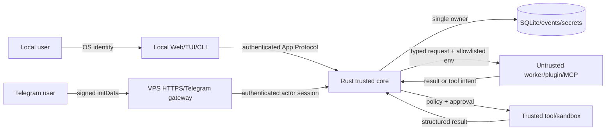

# M0 trust boundaries and threat model

## Boundaries

Trusted components are the Rust core, its migration/state owner, policy engine, secret filter and
trusted built-in tool adapters. React, Telegram input, model/provider output, plugin files, MCP
servers, hooks and compatibility workers are untrusted inputs even when locally installed.

## Threats and required controls

| Threat | Boundary | Required control/evidence |
|---|---|---|
| Worker proposes undeclared or malformed action | worker -> core | Closed schema, tool registry lookup, capability check before approval/dispatch |
| Worker/plugin reads DB or secrets | core -> worker | No DB handle; sanitized environment allowlist; per-provider credential grant only |
| Duplicate side effect after retry/reconnect | client/worker -> core | Actor-scoped idempotency key, durable intent/result, unique tool call effect key |
| Stale approval resolves another action | client -> core | Stable approval id, expected revision, authenticated actor/session and terminal rejection |
| Event loss/reordering on disconnect | transport -> client | Persist-before-publish, per-run unique sequence, cursor catch-up then bounded live tail |
| Worker crash corrupts run | worker -> supervisor | Child isolation, deadline/cancellation, terminal crash event and restart recovery test |
| Queue/memory exhaustion | any transport/worker | Frame and payload limits, bounded ingress/outbound queues, retryable overload error |
| Workspace escape through `..`, symlink, junction or race | tool -> filesystem | Resolved-root confinement, handle-based checks where available, adversarial Windows/POSIX tests |
| SSRF/DNS rebinding/redirect credential leak | network tool/MCP | Scheme/origin policy, DNS pinning, private/link-local deny, redirect revalidation, limits |
| Secret leakage in event/log/error | core/provider/tool | Central masking before persistence/transport; safe structured errors; negative fixtures |
| Plugin supply-chain substitution | installer -> plugin store | Pinned commit/hash, immutable install root, separate data root, provenance and trust reset |
| Hook changes after approval | plugin -> hook runner | Hash command/args/env/matcher/source; mutation revokes trust |
| Local browser request from hostile origin | browser -> loopback server | Per-install/session credential, strict Origin/CSRF, loopback bind and no wildcard credentials |
| VPS accidentally exposed without auth | operator -> server profile | Non-loopback startup fails closed without auth and TLS/trusted-proxy configuration |
| Forged/stale Telegram identity | Telegram -> gateway | Validate raw `initData` signature/hash, `auth_date`, replay window and bot audience; ignore `initDataUnsafe` |
| Cross-user access on VPS/Telegram | facade -> core/store | Transport-derived actor, owner checks on every session/run/artifact, adversarial tests |
| Fernet migration loses or exposes secrets | Python store -> Rust store | Legacy decrypt fixtures, versioned ciphertext, rotation/rollback test, no plaintext snapshots |
| Replay accidentally performs actions | replay -> core | Read-only replay mode; tool/provider/worker dispatch unavailable by construction |

## M0 evidence and remaining risk

The spike covers server-owned capability denial, revisioned approval, atomic in-database effect and
events, fingerprinted idempotency, bounded frames/messages/delivery, durable sequence, snapshot
cursor catch-up, worker crash, transport disconnect and process restart. It does not prove
production sandboxing, path
confinement, SSRF, Telegram authentication, bounded concurrent subscribers, secret compatibility or
SQLite migration recovery. Those remain blocking M6/M8/M10/M11 gates and cannot be inferred from
the spike.
